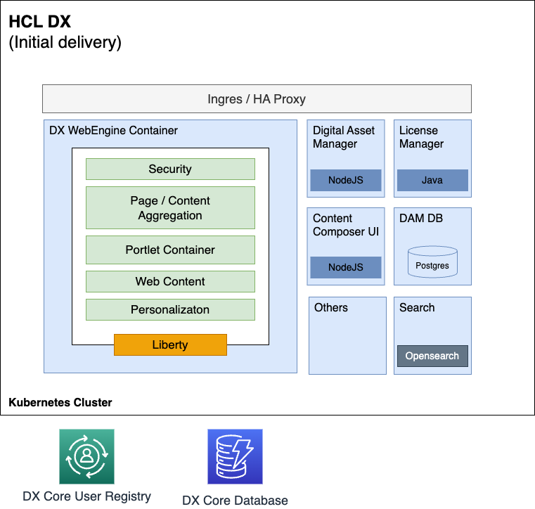

# Architecture and dependencies

## Architecture

The following two charts outline the transition from the Core container to the WebEngine container.

## Dependencies
Kubernetes with the right version (see system requirements) and helm. For production purposes a LDAP and DB2 are required.