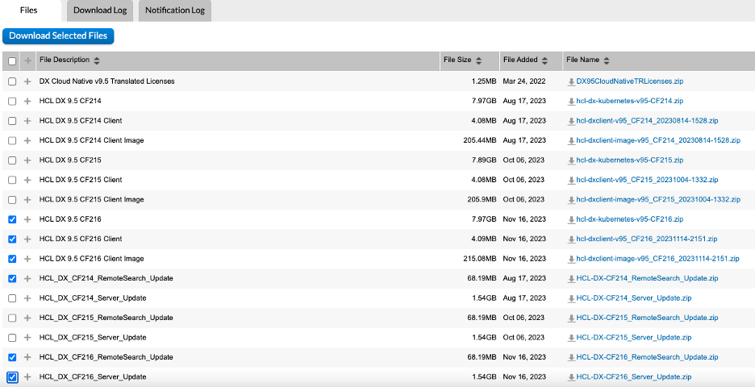
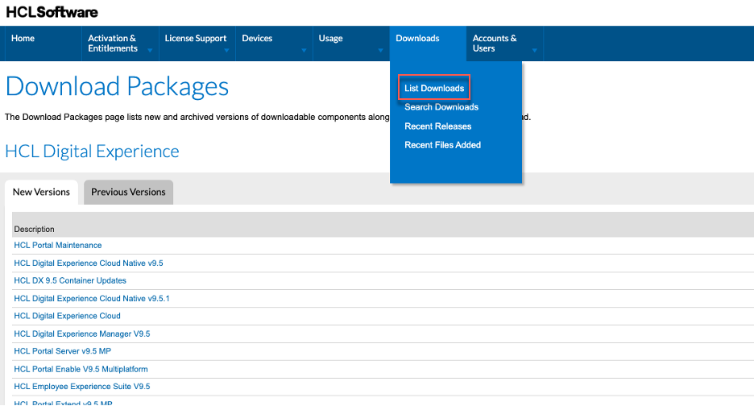

# Locating and Downloading DX Products

At this point, you should have been able to register an account and secure access to the License & Delivery Portal site.

## For HCL Customers

There are two ways to browse for the DX software installers or patches entitled to your organization.

In the home page, there are several widget windows available. Go to the **Your Downloads** window and select **HCL Digital Experience**. DX Compose is under this product line.

<!-- Will need new screenshot with Compose product -->

Another way is to hover on the **Downloads** tab and click **List Downloads**.

The portal lists the product line of the products you have entitlement for. Again, click **HCL Digital Experience** to locate DX Compose products.

<!-- Using an enlarged version of the file downloaded from Git but imho we need a better resolution ????-->

The latest version of the software and previous versions are shown.

In the DX Download Packages list, there are several products that are under the HCL Digital Experience product line according to the product customers have purchased and are entitled to. To track down DXs’ Download Packages Name, refer to the following list:

### Package name according to DX Offering
* HCL DX 9.5 CF224 Client
* HCL DX 9.5 CF224 Client Image
* HCL DX Compose 9.5 CF224
* HCL Leap PVU v9.3.6 Container - Leap image and Helm charts
* HCL Leap PVU v9.3.7 Container - Leap image and Helm charts
* HCL Volt Foundry Command Line Utility
* HCL Volt Foundry Container Deployment Tool
* HCL Volt Foundry Container Installer (Kubernetes cluster)

<!-- Not needed for Compose 224?
### Package name for DX Cumulative Fixes and Docker Releases
Fixes and Container updates are bundled up in a distinct package. To locate the latest fixes and container updates, refer to the following package names.

* HCL DX 9.5 Container Updates – for HCL Digital Experience Cloud Native 9.5.x products
* HCL Digital Experience Cloud – for HCL Digital Experience Cloud product
* HCL_Portal_8.5_9.0_9.5_CFs
-->
<!---### Package name for DX Tech Preview
We also have Tech Preview releases of HCL DX Content Composer, Digital Asset Management, and the Experience API. These can be deployed for evaluation only on the OpenShift or Amazon EKS environments, and downloaded from the below package:

* HCL DX 9.5 Tech Previews-->

### Package name for DXClient Tool
DXClient Tooling (dxclient_vx_xxxxxxxx-xxxx.zip) that are used to support CI/CD release process can be downloaded from the following packages:

* HCL DX 9.5 Container Updates
* HCL Digital Experience Cloud
* HCL_Portal_8.5_9.0_9.5_CFs

Click on the download package to select the download files.

If you only need to download a single file, click on the **File Name** hyperlink to start the HTTPS download.

<!--  -->

You can download multiple files at the same time. Select the files you want to download and click **Download Selected Files**. If you are doing this for the first time, you are prompted to download and install Download Manager.

!!!important "Using Download Manager not recommended"
    There are issues encountered with Download Manager and it is recommended to download files individually instead.

If you encounter issues with finding  software or downloading files, refer to the [Customer Support FAQ](https://opensource.hcltechsw.com/digital-experience/latest/guide_me/tutorials/access-software/support-faqs/) section for support.

## For HCL Business Partners

You can find the product under **Activation & Entitlements > List Entitlements**.

Alternatively, go to the **Quick Links** widget and click **List Entitlements** to find the product.

If you are looking for a specific product sold to a company, change the Search scope to choose **Sold-to ID** if you know your customer’s HCL ID. If you do not know your customer’s HCL ID, switch to **Sold-to display name** and type in a keyword from your customer’s company name.
<!---

-->
You can also search the view by **Product** name.

<!--To be able to tell which Download Packages are associated with the Product or the Entitlement, click the **Download Now** button.

The following is a sample list of Download Packages associated with the selected entitlement.

-->

Go to **Downloads > List Downloads** to view the Download packages associated with the Product or the Entitlement. Select the individual offering from the product list. 

From here, select the desired Download Package to look for the individual files and proceed with the Download.

It is recommended to download files individually. To start the HTTPS download, click the hyperlink under the **File Name** column.

<!--You can download multiple files at the same time by selecting the files you want to download and clicking **Download Selected Files**. If you are doing this for the first time, you are prompted to download and install Download Manager.

!!!important "Using Download Manager not recommended"
    There are issues encountered with Download Manager and it is recommended to download files individually instead.

-->

If you encounter issues with finding software or downloading files, refer to the [HCL Customer Support Program Resources site](https://support.hcltechsw.com/csm) for options to get support.

<!-- Add Compose to ....GitHub/dx-mkdocs/docs/get_started/download/software_licensing_portal/index.md ???-->
???+ info "Related information"
    - [Download and Install from the Software Licensing Portal](https://opensource.hcltechsw.com/digital-experience/latest/get_started/download/software_licensing_portal)
