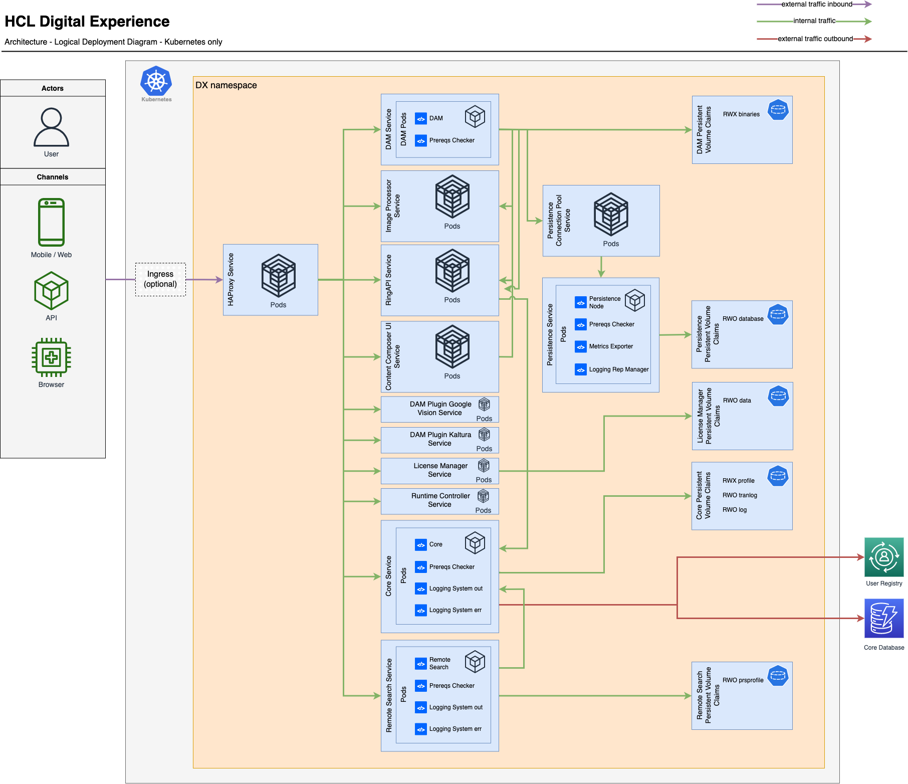

# Supported Container Platforms

Learn more about the containerization architecture, including the supported container platforms in deploying HCL Digital Experience Compose images for your environment.

HCL Digital Experience users can deploy HCL Digital Experience images in Docker, Red Hat OpenShift 4.1 and higher, also Amazon Elastic Kubernetes Service (EKS), Microsoft Azure Kubernetes Service (AKS) and Google Kubernetes Engine (GKE) for test, development, staging, and production environments.

Whether developing, testing, or running a full production environment, use of Docker images and containers are preferred for the ease of deploying applications, including the latest version of HCL Digital Experience Compose.

<!--

Please see the [Containerization requirements and limitations](../../../get_started/plan_deployment/container_deployment/limitations_requirements.md) and [Deployment](../container/helm_deployment/overview.md) sections of the documentation before you begin.
-->