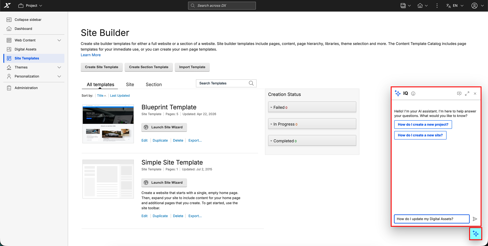

# Enabling and disabling IQ

[IQ](https://help.hcl-software.com/digital-experience/9.5/latest/build_sites/iq/){target="_blank"} is an AI-powered assistant integrated into HCL Digital Experience (DX) that provides real-time, context-aware assistance through a conversational interface. IQ is powered by the Model Context Protocol (MCP) and communicates with the backend service over WebSocket (JSON-RPC 2.0). To enable IQ in DX Compose, you must configure the `networking.dxIqService` parameter in the HCL DX Deployment Helm chart.

## Prerequisites

Before enabling IQ in DX Compose, ensure the following:

- The IQ backend service (`hcl-dx-iq` Helm chart) is deployed in your Kubernetes cluster and the `dx-iq-integrator` service is running. For more information, refer to [Installing IQ](https://help.hcl-software.com/digital-experience/9.5/latest/build_sites/iq/installation/){target="_blank"}.
- Network connectivity is available between DX Compose (WebEngine) pods and the IQ backend service.
- WebSocket connections are not blocked by firewalls or proxies.

## IQ configuration

IQ is deployed using a dedicated Helm chart (`hcl-dx-iq`), separate from the main DX Helm chart (`hcl-dx-deployment`). The IQ backend services run independently as Kubernetes microservices and integrate with DX through service networking and HAProxy routing. The Kubernetes service name for your IQ integrator deployment typically follows the `<release-name>-integrator` format. For example, if your release name is `dx-iq`, the service name is `dx-iq-integrator`.

Refer to the following sample snippet for configuring the DX Compose server to enable IQ:

```yaml
networking:
  # Set the IQ integrator service name to enable IQ
  dxIqService: "dx-iq-integrator"
```

Set the value of the key `dxIqService` to the Kubernetes service name of your IQ integrator deployment to enable IQ. Set the value to an empty string (`""`) to disable IQ:

```yaml
networking:
  dxIqService: ""
```

## Validation

After updating the `values.yaml` file:

- If you are running the server for the first time, refer to [Installing WebEngine](../../install/kubernetes_deployment/install.md).
- If you are upgrading previous configurations, refer to [Upgrading the Helm deployment](../working_with_compose/helm_upgrade_values.md).

## Access

Once IQ is enabled, access it using one of the following options:

- **In the DX Compose toolbar:** Select the **Open IQ chat** sparkle button in the top toolbar on standard DX pages to open the panel view sidebar.

    {: style="display: block; margin: 0 auto;"}

- **In Site Templates pages:** Select the **Open IQ chat** floating sparkle button to open the compact view chat window.

    {: style="display: block; margin: 0 auto;"}

For detailed information on accessing and using IQ, refer to the [IQ documentation](https://help.hcl-software.com/digital-experience/9.5/latest/build_sites/iq/){target="_blank"}.
