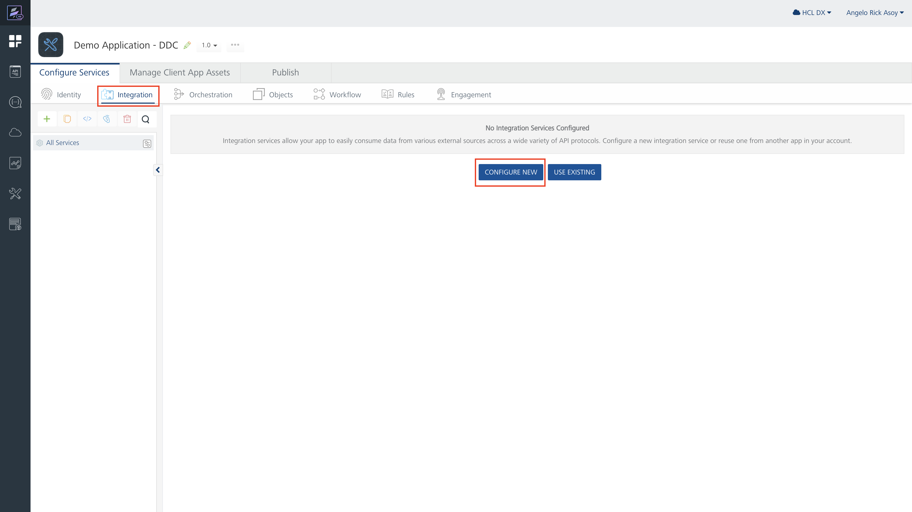

# Configuring Volt MX Foundry to connect to DDC

This section provides the steps on how to configure Volt MX Foundry to connect using the Digital Data Connector (DDC) in HCL Digital Experience (DX) Compose.

## Prerequisite

You must have access to the Volt MX Foundry Console via Volt MX Cloud or On-Premise instance. For more information, refer to the [Volt MX  cloud service](https://opensource.hcltechsw.com/volt-mx-docs/docs/documentation/Foundry/voltmx_foundry_user_guide/Content/Accessing_VoltMX_MBaaS_Portal.html){target="_blank"} documentation. This example uses the cloud service that Volt MX offers.

## Creating new integration service with Volt MX Foundry

Perform the following steps to use the new integration service with Volt MX Foundry cloud service:

1.  Go to [https://manage.hclvoltmx.com](https://manage.hclvoltmx.com){target="_blank"} to access paid cloud resources or [https://manage.demo-hclvoltmx.com](https://manage.demo-hclvoltmx.com){target="_blank"} to access your trial environment.

2.  Click the **Apps** icon, and then click **Add New**.

    { width="1500" }

3.  Create a new API endpoint using **Integration Service**. Click **Integration**, and then click **Configure New**.

    { width="1500" }

4.  Configure the service definition. 

    1. Enter a **Name**.
    2. In the **Service Type** field, select **JSON**. 
    3. Enter the **Base URL**. 
    4. Click **Save & Add Operation**.

    { width="1500" }


5.  Add an **Operation** for the service created. 
    1. Enter a **Name** for the operation.
    2. In the **Operation Security Level** field,, select **Anonymous App Users** or **Public**. These are the currently supported options of DDC.
    3. In the **Target URL** field, you can modify the URL if needed. If you included a parameter in the Target URL, you must define it in the **Request Input**, as shown in the following example.
    4. In the **Advance** section, click **Front End API**.
    5. In the **Resource Method** field, select **GET**. This is the only method currently supported by the DDC generic JSON plugin.

    { width="1500" }

    !!!note
        By default, DDC generic JSON plugin supports **GET** but the generic DDC JSON plugin can now send requests with methods such as **POST**, **PUT**, and **DELETE** by utilizing the extension of the plugin in the form of an optional content field named `httpmethod`. When using other resource methods such as **POST**, **PUT**, and **DELETE**, it is mandatory to create a content template with the `httpmethod` optional field element.

6. Add the **Response Output**. 

    1. Go to the **Response Output** tab, then click **Add Parameter**. 
        A row appears on the table. 
    2. Enter the **Name** and **Path** or the JSON Path. The path is based on the response of the target URL you defined in Service Definition. 
    3. Try the service by clicking **Save And Fetch Response**. If everything looks fine, click **Save Operation**.

    { width="1500" }

    !!!note
        You do not need to map all the responses in the  **Response Output** and can only map what you need. Make the response output flat as possible, as shown in the sample above. The values you set here will be reused as properties in DDC.

## Publishing and testing integration service with Volt MX Foundry

1. Under the **Publish** tab, click the **Publish** button.

    { width="1500" }

2. After the the App is published, you can test the API endpoint by using **Developer Portals**. 

    1. Click **Developer Portals** icon on the left navigation pane.
    2. Click the link where your environment is located. This opens a new tab in your browser.

    { width="1500" }

3. View the endpoint you created. 
    1. On the Developer Portals, click **API**.
    2. On the App you created, click the dropdown button. 
    3. Click the **View** link on the integration service you created. This redirects you to the Swagger UI page where you can try your Endpoint.

    { width="1500" }

4. Test the endpoint you created. 
    1. Before testing the endpoint, you must authorize the call if you selected the **Anonymous App Users** during the creation of the operation. Click the **Authorize** button.
    2. In the **Username** field, enter the **App Key**. 
    3. In the **Password** field, enter the the **App Secret**. 
        You can find the **App Key** and **App Secret** on the Swagger page.
        
    On the Swagger page, you will see the service that you created. Click the dropdown button beside the service and click **Try it out**. After completing the fields, you can now execute the API. There should be a response when everything is set up properly.

    { width="1500" }

    !!!note
        - If you created your Operation **Public** in Operation Security Level, you don't need any authorization.
        - You will need the information on this page during the setup to configure DDC.

## Creating Credential Vault Slot for the Volt MX Foundry Endpoint

If you chose **Anonymous App Users** for Operation Security Level, you must store the **App Key** and **App Secret** in Digital Experience by using the Credential Vault. Perform the following steps:

1. Get the values for **App Key** and **App Secret**. 

    1. In Volt MX Foundry, go to **Apps**.
    2. Select the App you created.
    3. Go to the **Publish** tab and then click the **App Key** icon. A dialog box appears.

    { width="1500" }

2. In the **App Key** window, hover over the **Key** and **Secret** values. Upon hovering, a **Copy** button should appear. Click the **Copy** button.

    { width="1500" }

3. Store the **App Key** and **App Secret** values in Digital Experience. Go to **Practitioner Studio > Administration**:

    { width="1500" }

4. On the Administration page, click **Security > Credential Vault**. The Credential Vault management portlet appears. 

    { width="1500" }

5. Select **Add a Vault slot**. The window for creating a vault slot appears.

    1. Add a **Name** for your vault slot. Provide a unique name because this becomes the slot identifier \(slot ID\).
    2. Select the **Vault Resource**  and **Vault Segment**. 
    3. Check the **Vault slot is shared** box.
    4. In the **Shared userID** field, enter the **App Key**.
    5. In the **Shared password** field, enter the **App Secret**. 
    5.  Click **OK** to save the changes. There should be a message that the vault slot was created successfully.

    { width="1500" }

## Creating outbound connection policy

After creating a Credential Vault slot, you can configure an outbound connection policy.

1. Create an XML file on your local machine and modify it according to your needs 

    You can use this sample outbound policy as a base:
    ``` xml
    <?xml version="1.0" encoding="UTF-8"?>
    <request type="update" version="8.0.0.0"
        xmlns:xsi="http://www.w3.org/2001/XMLSchema-instance" xsi:noNamespaceSchemaLocation="ProxyConfig_1.0.0.xsd">
        <proxy-config-data type="global">
            <data action="create"><![CDATA[<?xml version="1.0" encoding="UTF-8"?>

    <proxy-rules xmlns:xsi="http://www.w3.org/2001/XMLSchema-instance" xsi:noNamespaceSchemaLocation="http://www.ibm.com/xmlns/prod/sw/http/outbound/proxy-config/2.0">

    <policy name="demo_volt_mx_foundry_service" url="https://hcl-dx-dev.hclvoltmx.net/services/account/*" basic-auth-support="true" active="true">
        <actions>
            <!-- Step 2. Add the HTTP Method.  We will use GET or POST since this is what we defined when we created the operation of our service.-->
            <method>GET</method>
            <method>POST</method>

        </actions>

        <!-- Step 3. Add the credential vault slot that we have created. The vault slot name is also the vault slot id hpaa.slotid you will need to put in the policy. -->

        <meta-data>
            <name>hpaa.authtype</name>
            <value>http-basic</value>
        </meta-data>
        <meta-data>
            <name>hpaa.slotid</name>
            <value>demo-volt-mx-foundry-service</value>
        </meta-data>
        <meta-data>
            <name>forward-credentials-from-vault</name>
            <value>true</value>
        </meta-data>
    </policy>
    </proxy-rules>]]></data>
        </proxy-config-data>
    </request>
    ```

2. Copy the file (for example, `/tmp/demo_volt_mx_foundry_service_policy.xml`) inside your HCL DX Compose WebEngine instance.

3. Deploy the policy using **XMLAcess**: `./xmlaccess.sh -in /tmp/demo_volt_mx_foundry_service_policy.xml -out /tmp/demo.xml  -url http://localhost:9080/wps/config -user {userid} -pwd {password}`

!!!note
    The location of `xmlaccess.sh` is based on your deployment. In a default deployment, the location would be `/opt/openliberty/wlp/usr/svrcfg/scripts/xmlaccess`.

## Adding the HTTP outbound proxy 

1. In WebEngine, add the HTTP outbound proxy by navigating to the following path:

    ```
    /opt/openliberty/wlp/usr/servers/defaultServer/resources/dxconfig/config/services/ConfigService.properties
    ```

2. Add the following configuration for integration:

    ```
    wp.proxy.config.urlreplacement.digital_data_connector_policy.ddcDemo=https://hcl-dx-dev.hclvoltmx.net/services/account/*
    ```

3. Restart the server to apply the changes.