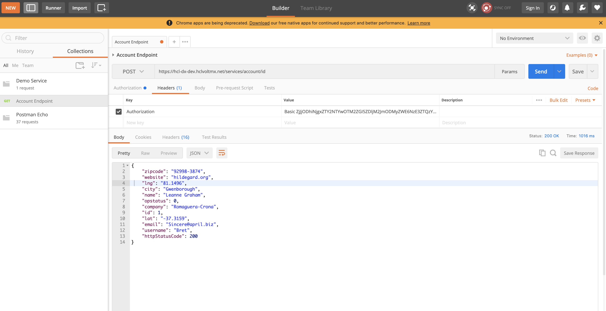
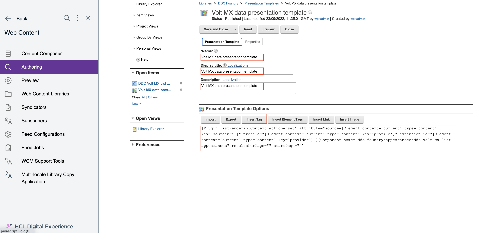
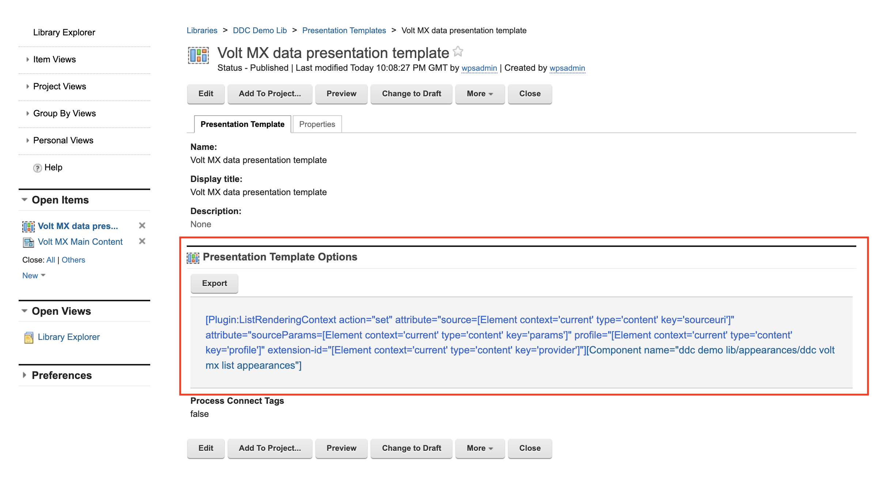
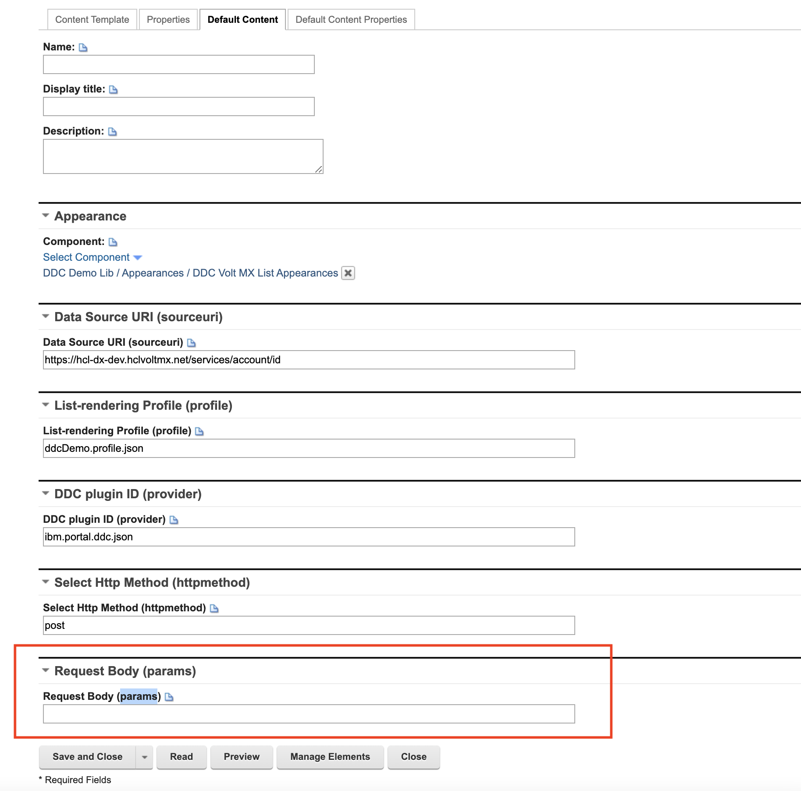
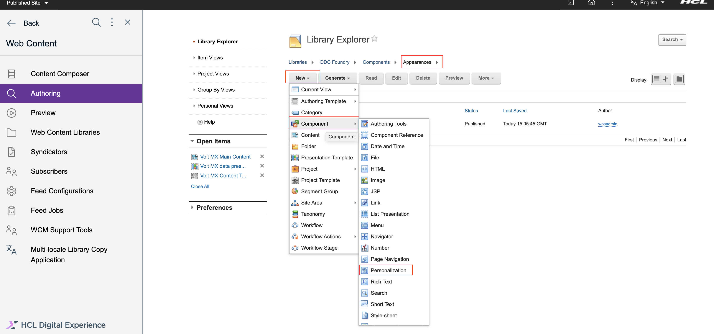
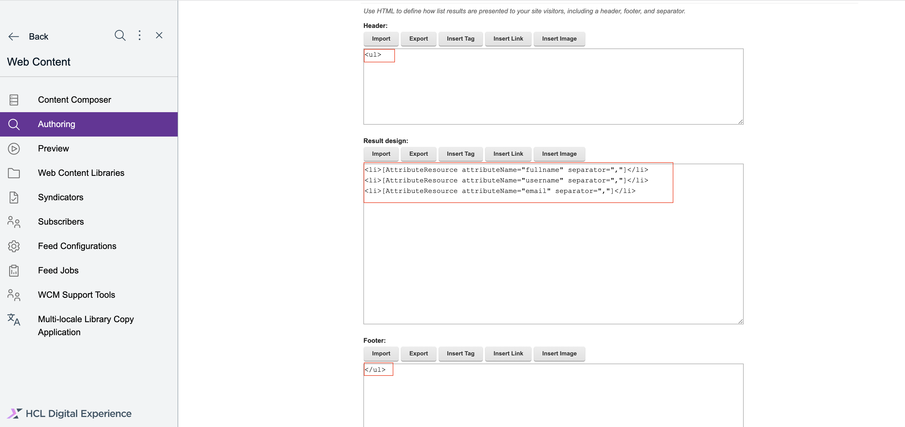
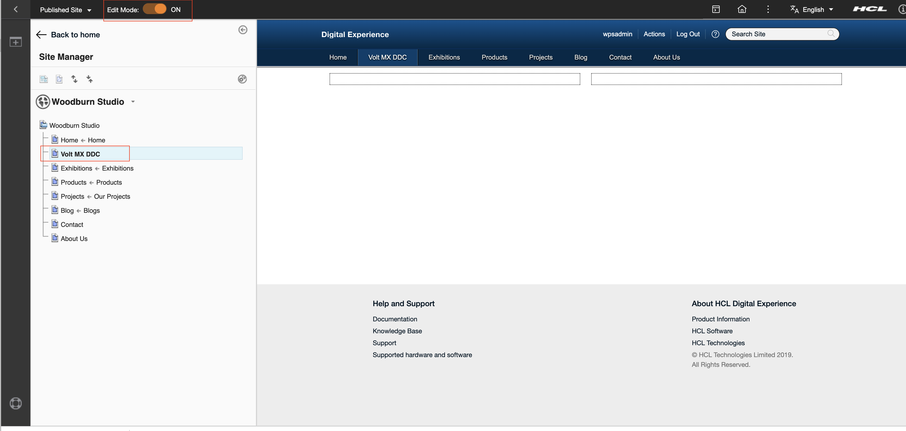
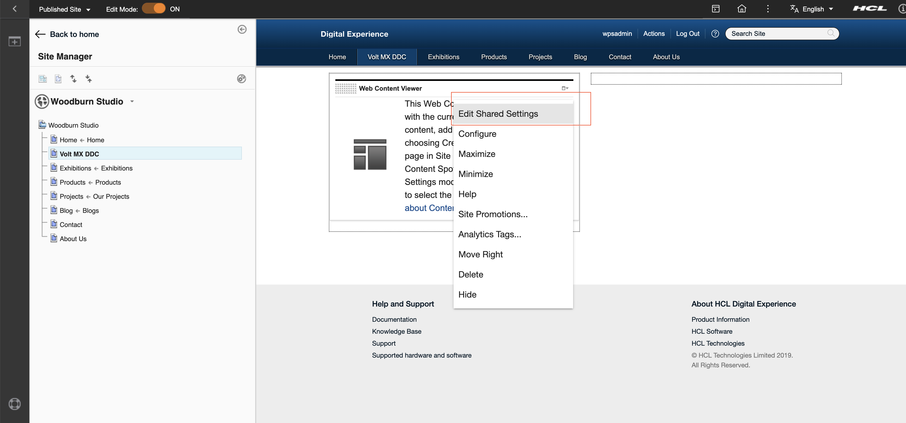

# Connecting to HCL Volt MX Foundry through DDC

This section provides the steps on using the Digital Data Connector (DDC) for HCL Digital Experience (DX) Compose framework to integrate data from HCL Volt MX Foundry (integrated external data sources) to your portal pages using HCL Web Content Manager presentation components.

## Prerequisite

Ensure that the your Volt MX Foundry application is configured correctly according to [Configuring Volt MX Foundry to connect to HCL DX DDC](./configuring_voltmx_foundry_to_connect_to_ddc.md).

## Creating a mapping for the DDC plug-in for the list-rendering profile

This section describes how to define the set of attributes available in the beans that are contained in bean lists that a DDC plug-in generates in list-rendering profile.

For more information, see [Technical concepts](https://help.hcl-software.com/digital-experience/9.5/latest/extend_dx/ddc/plrf_tech_concepts/){target="_blank"}.

The following API end point and response are used to create this sample document:

- Sample API end point for **GET**

  { width="1500" }


- Sample API end point for **POST**

  { width="1500" }


### Creating the list-rendering profile

1. In WebEngine, add the list-rendering profile by navigating to the following path:

    ```
    /opt/openliberty/wlp/usr/servers/defaultServer/resources/dxconfig/config/services/ListRenderingProfileService.properties
    ```

2. Add the following configuration for our integration:

    ```
    ddcDemo.Name=ddcDemo.profile.json
    ddcDemo.BeanListProviderID=ibm.portal.ddc.json
    ddcDemo.ItemAttribute.id=id
    ddcDemo.ItemAttribute.fullname=name
    ddcDemo.ItemAttribute.email=email
    ddcDemo.ItemAttribute.username=username
    ddcDemo.ListItemSelection=.
    ddcDemo.Type=BasicJSONSelection
    ```

    This configuration defines a list-rendering profile named `ddcDemo` with the following attributes:

    - `Name`: The name of the profile file.
    - `BeanListProviderID`: The ID of the bean list provider.
    - `ItemAttribute.id`: The attribute for the item ID.
    - `ItemAttribute.fullname`: The attribute for the full name.
    - `ItemAttribute.email`: The attribute for the email.
    - `ItemAttribute.username`: The attribute for the username.
    - `ListItemSelection`: The selection criteria for the list items.
    - `Type`: The type of selection.

3. Save the changes and restart the server to apply the new list-rendering profile.

## WCM presentation components

You can use an existing or a new Web Content Manager (WCM) library. The example in this page uses a new library, DDC Foundry, with default items such as site area and workflow. You must create WCM artifacts under four folders:

- Content
- Components
- Authoring Templates
- Presentation Templates

Refer to [Creating web content libraries](https://help.hcl-software.com/digital-experience/9.5/latest/build_sites/create_sites/building_website/content_libraries/){target="_blank"} for instructions on how to work with WCM libraries.

### Creating a Presentation Template

Create a Presentation Template to set the context of the DDC content. Refer to the following steps:

1. Go to **Web Content > Authoring**.

2. Create a new Presentation Template.

    1. Click **New > Presentation Template**. 
    2. Enter a **Name**, **Display title**, and **Description** for your presentation template.
        The recommended name is **Volt MX data presentation template**.
    3. Under **Presentation Template Options**, click **Insert Tag**.

    { width="1500" }


    4. Select the type of tag to create, and then define parameters for the selected tag. You can then either copy and paste the tag into your design, or click **OK** to insert the tag at the current cursor location.

    { width="1500" }


    **Sample Presentation Template options**

    ```
    [Plugin:ListRenderingContext action="set" attribute="source=[Element context='current' type='content' key='sourceuri']" profile="[Element context='current' type='content' key='profile']" extension-id="[Element context='current' type='content' key='provider']"][Component name="ddc foundry/appearances/ddc volt mx list appearances" resultsPerPage="" startPage=""]
    ```

    - Under `attribute`, define the data `source` endpoint. The content field set in this example is `sourceuri`, where you saved the **endpoint** in the content item.
    - `profile` refers to the List-Rendering Profile which was saved earlier in the WAS console. The content field that is set in this example is also `profile`, which is saved in the content item with the `ddcDemo.profile.json` value.
    - `extension-id` refers to the DDC plugin ID. The content field set in this example is `provider`, which is saved in the content item with value `ibm.portal.ddc.json`.

3. Click **Save and Close**.

!!!note
    If you selected any other **Resource Method** (for example, **POST** from `Advanced` > `Front End API` > `Resource Method`) while creating a new integration service with Volt MX Foundry, you might need the capability to submit data to the API which DDC will try to parse as **sourceParams**. In that case, you must include that in your Presentation Template.

    **Sample Presentation Template options with params**

    ```
    [Plugin:ListRenderingContext action="set" attribute="source=[Element context='current' type='content' key='sourceuri']" attribute="sourceParams=[Element context='current' type='content' key='params']" profile="[Element context='current' type='content' key='profile']" extension-id="[Element context='current' type='content' key='provider']"][Component name="ddc foundry/appearances/ddc volt mx list appearances" resultsPerPage="" startPage=""]
    ```

    Under `attribute`, define the data `sourceParams`. The content field set in this example is `params`, which is saved in the content item.

    { width="1000" }

### Creating a Content Template

Under Authoring Templates, create a Content Template.

1. Click **New > Authoring Template > Content Template**.

    { width="1500" }

 
2. Add the **Name**, **Display title**, and **Description** for your Content Template. 

    The recommended name is **Volt MX Content Template**.
    
3. Under **Item Properties**, select the presentation template you created in [Creating a presentation template](#creating-a-presentation-template) as the **Default Presentation Template**.

    { width="1500" }


3. Click **Manage Element** and add the following elements to the content template:

    | Element type                   | Name                                       | Display title              |
    | ------------------------------ | ------------------------------------------ | ---------------------------|
    | Component Reference            | appearance                                 | Appearance                 |
    | Short Text                     | sourceuri                                  | Data Source URI            |
    | Short Text                     | profile                                    | List Rendering Profile     |
    | Short Text                     | provider                                   | DDC Plugin                 |

    { width="1500" }


    !!!note
        In case of **GET** resource method, adding **httpmethod** element is not necessary. Vy default, the connection is initially set to **GET**.
        
        If you selected any other **Resource Method** (for example, **POST** from `Advanced` > `Front End API` > `Resource Method`) while creating a new integration service with Volt MX Foundry, then you need to add another element **httpmethod**. This element (**httpmethod**) can be added as **Short Text**, **Text**, or **OptionSelection**. A content created from this content template can then load and render data from data sources using other resource methods. Leaving the optional httpmethod field value **blank** or empty when creating your content, which is based on the content template, would still have the connection fallback to **GET**.

    | Element type                   | Name                                       | Display title              |
    | ------------------------------ | ------------------------------------------ | ---------------------------|
    | Short Text                     | httpmethod                                 | Select Http Method         |

    { width="1500" }


4. Click **Default Content Properties** and add **Express workflow**.

    { width="1500" }


5. Click **Save and Close**.

!!!note
    If you selected any other **Resource Method** (for example, **POST** from `Advanced` > `Front End API` > `Resource Method`) while creating a new integration service with Volt MX Foundry, you might need the capability to submit data to the API which DDC will try to parse as **sourceParams** using the Presentation Template you created in the previous section. In that case, you must add a content field in your Content Template that will save this. It can have any name but this example uses **params**.

    | Element type                   | Name                                       | Display title              |
    | ------------------------------ | ------------------------------------------ | ---------------------------|
    | Short Text                     | params                                     | Request Body               |

    { width="1000" }

### Creating a List Appearance

1. Go to the Library Explorer. The following default items are available: **Content**, **Categories**, **Components**, **Authoring Templates**, **Presentation Templates**, **Workflow Items**, and **Segments**.

    { width="1500" }


2. Create an **Appearances** folder under **Components**. This is to ensure that your personalization components use the DDC selection rule. Select pluggable resources can be found easily in one place.

    { width="1500" }


3. Under the **Appearances** folder, create a new Personalization component.

    1. Click **New > Component > Personalization**.

        { width="1500" }


    2. Enter the **Name**, **Display title**, and **Description**. The recommended name is **DDC Volt MX List Appearances**.

        { width="1500" }


    3. Under **Personalization Element**, click **New**. 
    
    4. Under **New Rule**, click **Web Content** and select **Pluggable Resources**. Click **Save**.

        { width="1500" }

 
    5. In the List Presentation Markup, add the following:
        - Header: `<ul>`
        - Result design:
              ```
              <li>[AttributeResource attributeName="fullname" separator=","]</li>
              <li>[AttributeResource attributeName="username" separator=","]</li>
              <li>[AttributeResource attributeName="email" separator=","]</li>
              ```
        - Footer: `</ul>`
        !!!note
            The `attributeName` used here is the last part of the `itemAttribute` you have specified in your [list-rendering profile](#creating-the-list-rendering-profile). For example, `ddcDemo.ItemAttribute.fullname`.

        { width="1500" }


    6. Click **Save and Close**.

### Creating a Content item

1. Under your libraries, click **Content > Articles**. 

2. Create a new Content item from the Content Template that you created in [Creating a Content Template](#creating-a-content-template).

    { width="1500" }


3. Add the **Name**, **Display title**, and **Description** of the Content item.
    The recommended name is **Volt MX Main Content**, and in the content fields / elements, provide the following values:

    | Content field title            | Value                                                        |
    | ------------------------------ | ------------------------------------------                   |
    | **Appearance**                     | auto filled once you've chosen a component                   |
    | **Data Source URI**                | https://hcl-dx-dev.hclvoltmx.net/services/account/id?id=1    |
    | **List Rendering Profile**         | ddcDemo.profile.json                                         |
    | **DDC Plugin**                     | ibm.portal.ddc.json                                          |

    { width="1500" }


    !!!note
        If you selected any other **Resource Method** (for example - **POST** from `Advanced` > `Front End API` > `Resource Method`) while creating a new integration service with Volt MX Foundry then you need to provide value for **httpmethod**. Also, the value of **Data Source URI** would be the POST URL endpoint in this case.

    | Content field title            | Value                                                        |
    | ------------------------------ | ------------------------------------------                   |
    | Data Source URI                | https://hcl-dx-dev.hclvoltmx.net/services/account/id         |
    | Select Http Method             | post                                                         |

    

4. Click **Save and Close**.

!!!note
    If you selected any other **Resource Method** (for example, **POST** from `Advanced` > `Front End API` > `Resource Method`) while creating a new integration service with Volt MX Foundry, you might need the capability to submit data to the API which DDC will try to parse as **sourceParams** using the Presentation Template you created in a previous section. In that case, you must provide value for **params** in your Content item. You can pass many key-value pairs of data and it should have the format of a URL query string.

    | Content field title            | Value                                                        |
    | ------------------------------ | ------------------------------------------                   |
    | Request Body                   | ?id=2                                                        |

    { width="1000" }

## Using WCM artifacts on a Portal page

Now you can use all the WCM artifacts that you created on a portal page.

!!!note
    This guide uses an existing page but you can create a completely new Content Root or any child or sibling page on any site. Refer to [Creating a page from the site toolbar](https://help.hcl-software.com/digital-experience/9.5/latest/manage_content/wcm_delivery/deliver_webcontent_on_dx/displaying_content/mp_wcm_createpage/){target="_blank"} for creating a page.

1. Go to any page (for example, Volt MX DDC) and enable **Edit Mode**.

    { width="1500" }

2. In the site toolbar, click the **Add page components and applications** (plus) icon. Then click **Applications** and add a **Web Content Viewer** on the page.

    { width="1500" }

3. Click the **Add To Page** button.

    { width="1500" }

4. Inside the Web Content Viewer, click on the upper right dropdown button and select **Edit Shared Settings**.

    { width="1500" }

5. Under **Content**, change the mapped content to the Content item you created in [Creating a Content item](#creating-a-content-item).

    { width="1500" }

6. Click **OK**. 

    The following output page is displayed.

    { width="1500" }

