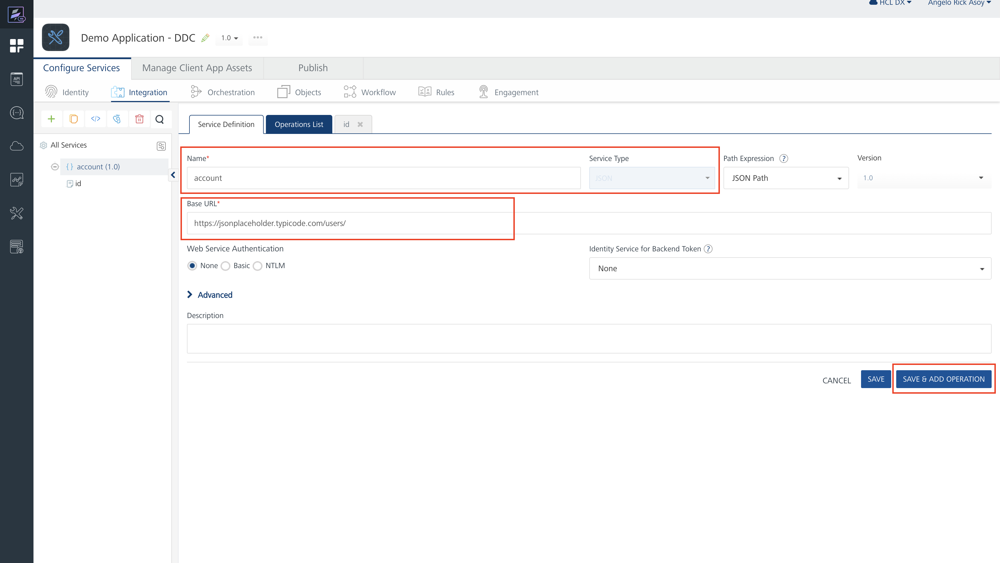
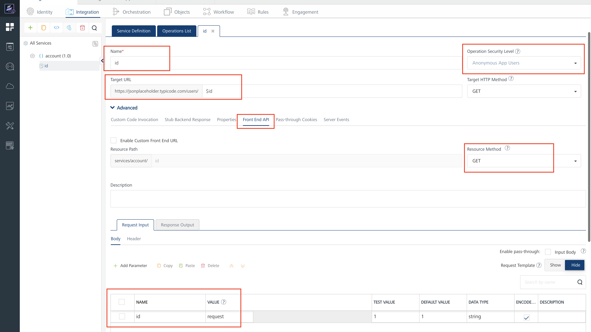
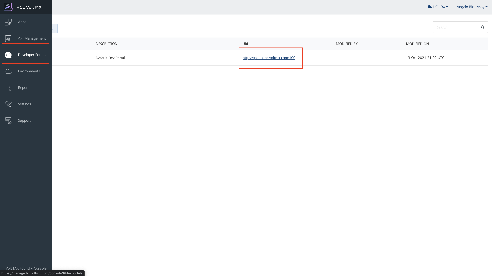
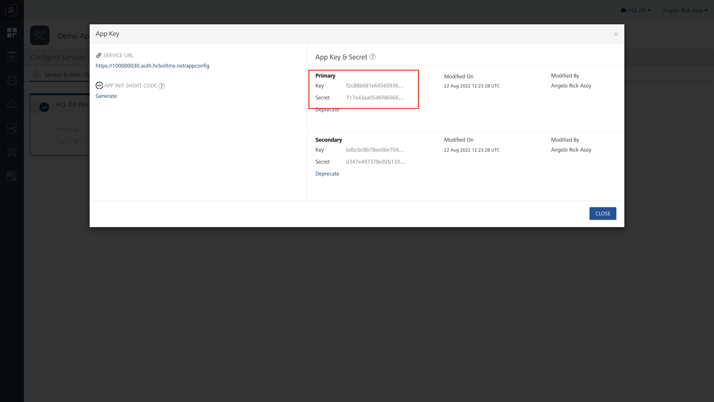
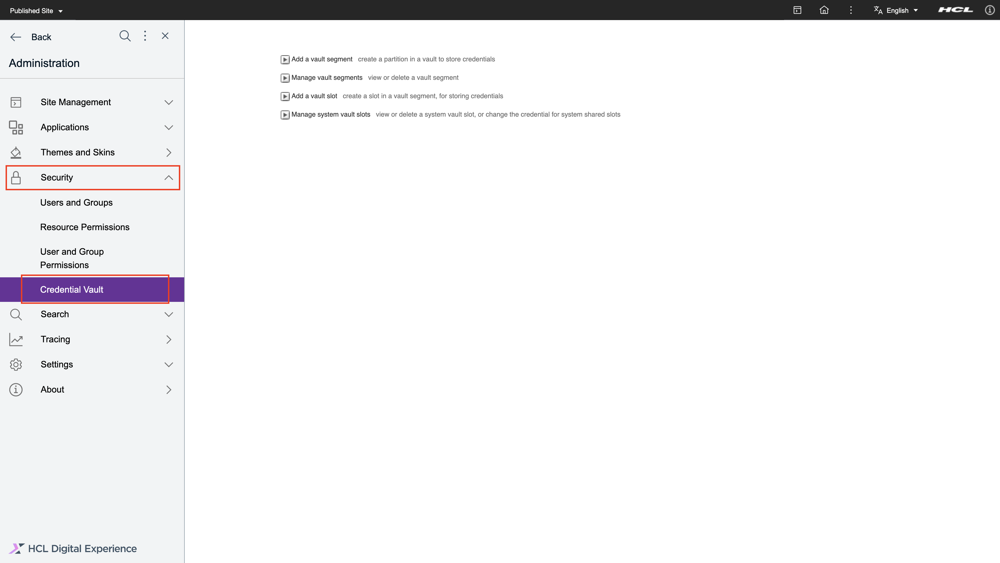

# Configuring Volt MX Foundry to connect to Digital Experience Digital Data Connector

This section provides the steps on how to configure Volt MX Foundry to connect via HCL DX Compose DDC.

## Prerequisite

You must have access to the Volt MX Foundry Console via Volt MX Cloud or On-Premise instance. For more information, refer to the [Volt MX  cloud service](https://opensource.hcltechsw.com/volt-mx-docs/docs/documentation/Foundry/voltmx_foundry_user_guide/Content/Accessing_VoltMX_MBaaS_Portal.html) documentation. In this sample, we will use the cloud service that Volt MX offers.

## Create new integration service with Volt MX Foundry

Perform the following steps to use the new integration service with Volt MX Foundry cloud service:

1.  Go to [https://manage.hclvoltmx.com](https://manage.hclvoltmx.com) to access paid cloud resources or [https://manage.demo-hclvoltmx.com](https://manage.demo-hclvoltmx.com) to access your trial environment.

    

2.  Click the **Apps** icon, and then click **Add New**.

    

3.  Create a new API endpoint via **Integration Service**. Click **Integration**, and then click **Configure New**.

    

4.  Configure the service definition. Enter a **Name**, then select **JSON** as the **Service Type**, and enter the **Base URL**. Click **Save & Add Operation**.

    


5.  Add an **Operation** for the service that we created. First, enter a **Name**, then under **Operation Security Level**, select **Anonymous App Users** or **Public** since it is the only option right now that is supported in DDC. You can modify the **Target URL** if the URL needs modification. If you include a parameter in the Target URL, you must define it in the **Request Input**, as shown in the example below. Then in the **Advance** section, click **Front End API**. Under **Resource Method**, select **GET** since it's the only method currently supported by the DDC generic JSON plugin.

    

    !!!note
        By default DDC generic JSON plugin supports **GET** but the generic DDC JSON plugin can now send requests with methods such as **POST**, **PUT**, **DELETE** etc by utilizing the extension of the plugin in the form of an optional content field named httpmethod. When using other resource methods such as **POST**, **PUT**, **DELETE**, it is mandatory to create a content template with the httpmethod optional field element.

6. Adding **Response Output**. Click the **Response Output** tab, then click **Add Parameter**. After clicking, a row will appear on the table. Add the **Name**, then the **Path** or the JSON Path. The path is based on the response of the target URL you define in Service Definition. Try the service by clicking **Save And Fetch Response**. If everything looks fine, then click **Save Operation**.

    

    !!!note
        You do not need to map all the responses in the  **Response Output** and can only map what you need. Make the response output flat as possible, as shown in the sample above. The values you set here will be reused as properties in DDC.

## Publish and Test integration service with Volt MX Foundry

1. Under the **Publish** tab, click the **Publish** button.

    

2. Once the App is published, you can now test the API endpoint by using **Developer Portals**. Click **Developer Portals** icon on the left side, then click on the link where your environment is located. This will open a new tab in your browser.

    

3. View the endpoint we created. On the Developer Portals, click **API**, then under the App you created, there is a dropdown button. Click the **View** link on the integration service you have created. This will redirect you to the Swagger UI page where you can try your Endpoint.

    

4. Test the endpoint that you created. Before testing the endpoint, you must authorize the call since you chose **Anonymous App Users** during the creation of the operation. Click the **Authorize** button and put in the username field the **App Key** and in the password field the **App Secret**. Both values can be found on the Swagger page. On the Swagger page, you will see the service that you created, then click the dropdown beside it, then click the **Try Out** button. Once all the fields are filled up, you can now execute the API. There should be a response when everything is set up properly.

    

    !!!note
        If you created your Operation **Public** in Operation Security Level you dont need any authorization.

    !!!note
        You will need the information on this page later during the setup to configure DDC accordingly.

## Creating Credential Vault Slot for the Volt MX Foundry Endpoint

If you chose **Anonymous App Users** for Operation Security Level, you need to store the **App Key** and **App Secret** in Digital Experience. You can achieve this by using the Credential Vault. Perform the following steps:

1. We first need to get the values for **App Key** and **App Secret**. We can get those values in Volt MX Foundry by going to **Apps**, then selecting the App that we have created, then clicking the **Publish** tab, and then clicking the **App Key** icon. A dialog box should appear.

    

2. After the dialog appears, we can now see the App Key and App Secret of our created App. We can copy its value by hovering over the App Key and App Secret Value, and after hovering, we should see a **Copy** button. Click the Copy button.

    

3. After getting the values of **App Key** and **App Secret**, we can now store them in Digital Experience. Go to **Practitioner Studio**, then **Administration**

    

4. On the Administration page, click **Security** then **Credential Vault**. The Credential Vault management portlet is shown. 

    


5. Select **Add a Vault slot**. The window for creating a vault slot is shown. 
    a. Add a **Vault slot name**. This becomes the slot identifier \(slot ID\), hence provide a unique name. 
    b. Select the **Vault Resource**  and **Vault Segment**. 
    c. Set the Vault slot as **Shared**.
    d. Set the user ID as the **App Key** and password as the  **App Secret**. 
    e.  Click **OK** button to save the changes. There should be a message that the vault slot was created successfully.

    

## Creating Outbound Connection Policy

Since we already have the Credential Vault slot, we can now configure an outbound connection policy.

1. Create an xml file on your local machine and modify it according to your needs. 

    You can use this sample outbound policy as a base:
    ``` xml
    <?xml version="1.0" encoding="UTF-8"?>
    <request type="update" version="8.0.0.0"
        xmlns:xsi="http://www.w3.org/2001/XMLSchema-instance" xsi:noNamespaceSchemaLocation="ProxyConfig_1.0.0.xsd">
        <proxy-config-data type="global">
            <data action="create"><![CDATA[<?xml version="1.0" encoding="UTF-8"?>

    <proxy-rules xmlns:xsi="http://www.w3.org/2001/XMLSchema-instance" xsi:noNamespaceSchemaLocation="http://www.ibm.com/xmlns/prod/sw/http/outbound/proxy-config/2.0">

    <policy name="demo_volt_mx_foundry_service" url="https://hcl-dx-dev.hclvoltmx.net/services/account/*" basic-auth-support="true" active="true">
        <actions>
            <!-- Step 2. Add the HTTP Method.  We will use GET or POST since this is what we defined when we created the operation of our service.-->
            <method>GET</method>
            <method>POST</method>

        </actions>

        <!-- Step 3. Add the credential vault slot that we have created. The vault slot name is also the vault slot id hpaa.slotid you will need to put in the policy. -->

        <meta-data>
            <name>hpaa.authtype</name>
            <value>http-basic</value>
        </meta-data>
        <meta-data>
            <name>hpaa.slotid</name>
            <value>demo-volt-mx-foundry-service</value>
        </meta-data>
        <meta-data>
            <name>forward-credentials-from-vault</name>
            <value>true</value>
        </meta-data>
    </policy>
    </proxy-rules>]]></data>
        </proxy-config-data>
    </request>
    ```

2. Then you copy the file (for example: `/tmp/demo_volt_mx_foundry_service_policy.xml`) inside your HCL DX Compose WebEngine instance.

3. And deploy the policy using the **XMLAcess**: `./xmlaccess.sh -in /tmp/demo_volt_mx_foundry_service_policy.xml -out /tmp/demo.xml  -url http://localhost:9080/wps/config -user {userid} -pwd {password}`
!!!note
    The location of `xmlaccess.sh` is based on your deployment. In a default deployment, the location would be `/opt/openliberty/wlp/usr/svrcfg/scripts/xmlaccess`.

## Adding HTTP Outbound Proxy 

In WebEngine, you can add the HTTP outbound proxy by navigating to the following path:

/opt/openliberty/wlp/usr/servers/defaultServer/resources/dxconfig/config/services/ConfigService.properties

Add the following configuration for our integration:
wp.proxy.config.urlreplacement.digital_data_connector_policy.ddcDemo=https://hcl-dx-dev.hclvoltmx.net/services/account/*

Restart the server to apply the changes.