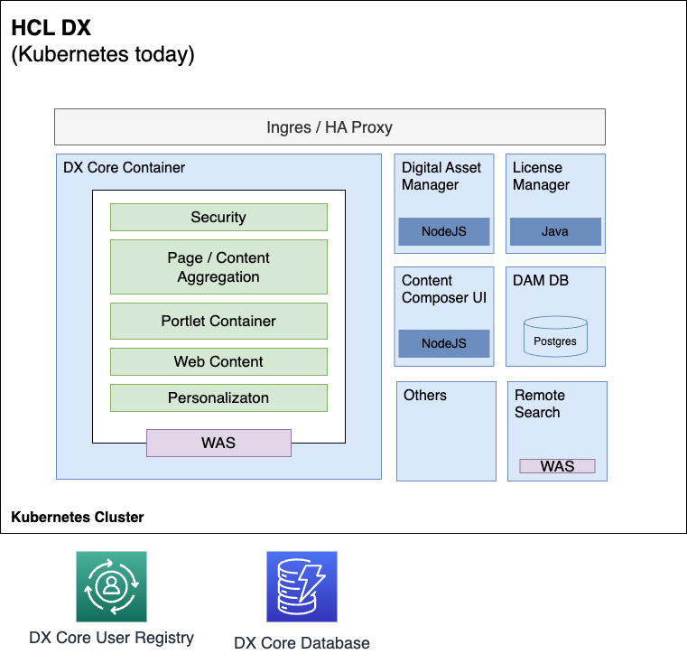
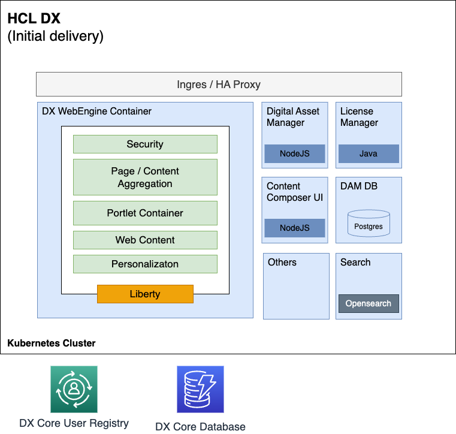

# Architecture and Dependencies

The following images show the transition in terms of architecture from the DX Core container to the WebEngine container.

The first diagram shows the architecture of the existing DX Core container.

The second diagram shows the architecture of the WebEngine container.

## Dependencies

For the correct version of Kubernetes to use, see the topic [Kubernetes runtime](../../system_requirements/kubernetes/kubernetes-runtime.md).

For production purposes, a Lightweight Directory Access Protocol (LDAP) server and DB2 are required. See [System Requirements](webengine_sysreq.md) for more information.