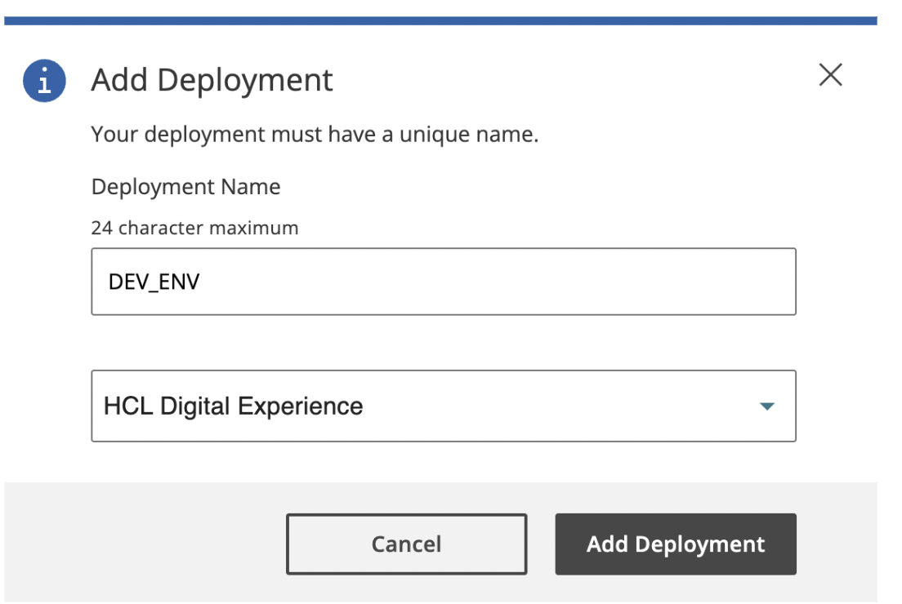
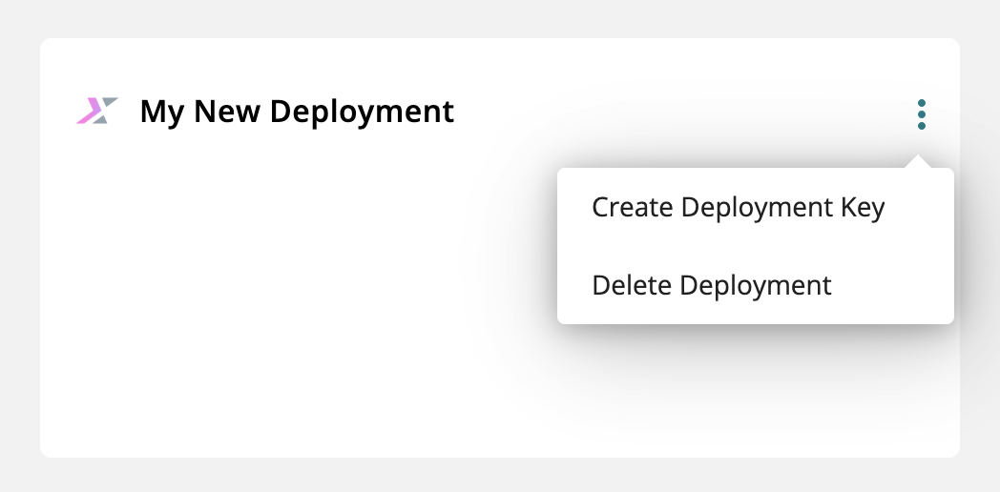
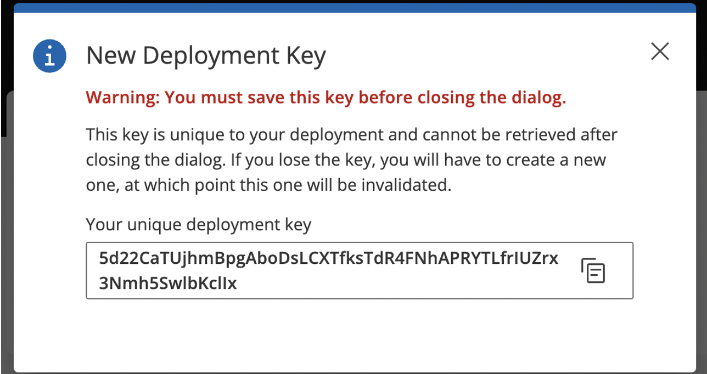

# Entitlement checking in the My HCLSoftware portal

## Creating an MHS deployment instance

An MHS deployment instance is a registered environment (such as development, test, or production) associated with a customer’s account in the MHS portal. It serves as the target for license metering and entitlement tracking, allowing HCL software (for example, HCL DX) to report usage data such as user sessions. Each deployment instance helps monitor consumption against licensed entitlements. In connected environments, the DX License Manager reports directly to the assigned instance.

Refer to the following steps to create an MHS deployment instance:

1. Log in to [MHS portal](https://my.hcltechsw.com/){target="_blank"}.

2. Go to **Deployments** tab and click **Add Deployment**.

3. In the **Add Deployments** window, enter the **Deployment Name** and select the type of the deployment.

    { width="500" }

4. Click **Add Deployment**.

## Obtaining the deployment key

After creating a deployment, refer to the following steps to get the deployment key:

1. Go to the **Deployments** tab and locate your newly created deployment.

2. Click the three-dot icon on your deployment then select **Create Deployment Key** to create a deployment key.

    { width="500" }

3. Copy and save the unique deployment key. This will serve as an initial refresh token.

    { width="500" }

!!! Tip
    If you lose your deployment key, you can generate a new one. On the **Deployments** tab, open your deployment and click the three-dot icon. Then, select **Replace Deployment Key** to generate a new key.


## Configuring License Server

To validate the entitlement details for your software, configure the following properties in the Helm chart:

```yaml

# License Manager Configuration
  licenseManager:
    # Configures if this environment is a production environment.
    # For non production environments sessions are not counted but the license
    # is still validated.
    productionEnvironment: true
    # MHS License Server URI
    licenseServerUri: "https://api.hcltechsw.com"
    # Custom Deployment key secret for MHS deployment instance
    customMhsDeploymentKeySecret: ""
    # Deployment key for MHS deployment instance
    mhsDeploymentKey: ""

```

- `productionEnvironment`: Set to `true` to send usage reports to MHS. For other environments (for example, test or UAT), set to `false`.
- `licenseServerUri`: Set to the MHS License Server URI (`https://api.hcltechsw.com`).
- `customMhsDeploymentKeySecret`: The name of a secret that has been created and contains the deployment key in a data element called `deploymentKey`. Use a secret for production environments or in any situation where you prefer not to store the deployment key directly in `values.yaml`.
- `mhsDeploymentKey`: A unique identifier for a specific deployment of DX, against which the usage information for that environment is reported. You can generate a deployment and its associated deployment key for each environment in which you enable License Manager within the [My HCLSoftware portal](https://my.hcltechsw.com/){target="_blank"}. Put the deployment key in this value element for non-production environments or in situations where storing the key directly in `values.yaml` is acceptable.

To create a custom secret, run the following command:

```sh
# Sample command for creating a custom secret
kubectl create secret generic <secret-name> --from-literal=deploymentKey=<deploymentKey> --namespace=<namespace>
```

See the following secret produced by the command:

```yaml
apiVersion: v1
data:
  deploymentKey: <deploymentKey> # base64 encoded version of <deploymentKey> from the command
kind: Secret
metadata:
  name: <secret-name>
  namespace: <namespace>
type: Opaque
```

## Expected logs

This section shows what a successful entitlement check should look like. The logs should indicate a successful connection to the entitlement server, as illustrated in the following example:

```log
INFO: The connection to the entitlement server is successful. You have a valid HCL Digital Experience Cloud Native 9.5 entitlement. HCL DX Cloud Native 9.5 server starts.
INFO: Starting session count of the license manager
INFO: License validity: true
```
