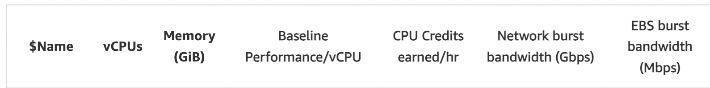
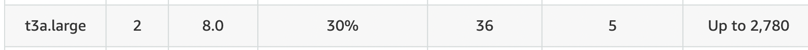
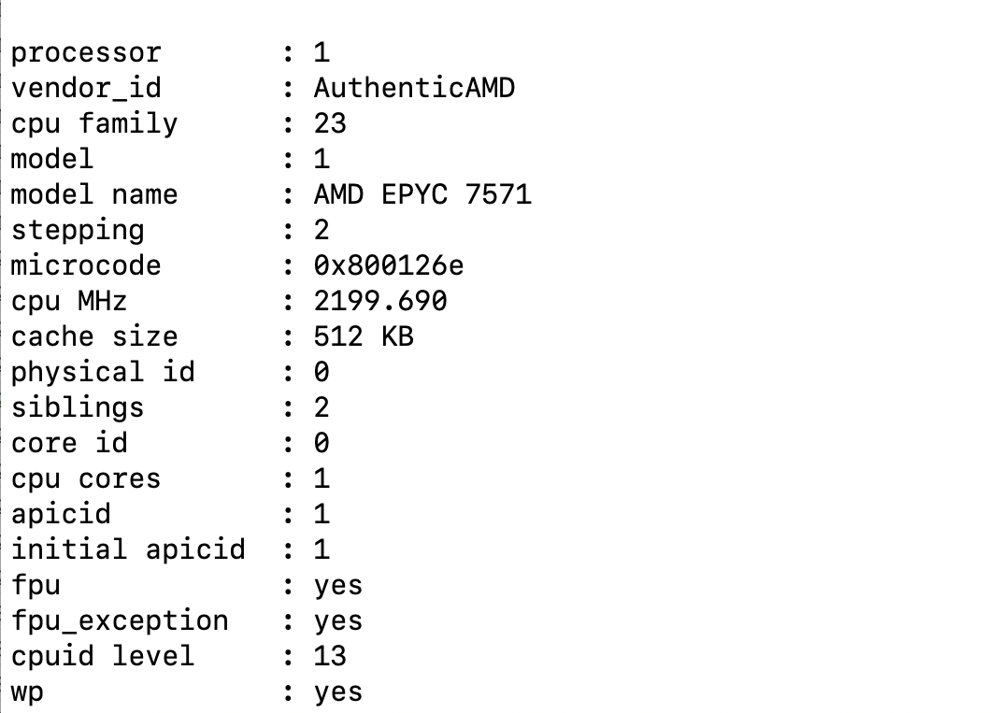
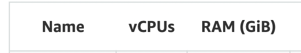

# Sizing guidance for rendering in a small-sized Kubernetes configuration

This topic provides the details of the environments used for rendering in a small-sized Kubernetes configuration. You can also find the test results and recommendations for small configurations on this page.

## Methodology

This sizing activity rendered scenarios for the Web Content Manager (WCM), Digital Asset Management (DAM), and HCL Digital Experience (DX) pages and portlets. This activity used a rendering setup enabled in AWS/Native-Kubernetes, where Kubernetes is installed directly in Amazon Elastic Cloud Compute (EC2) instances. A combination run was performed that rendered WCM content, DAM assets, and DX pages and portlets. The load distribution was WCM content (40%), DAM assets (30%), and DX pages and portlets (30%). All systems were pre-populated before performing the rendering tests.

To achieve the 1,000 concurrent users mark, an initial set of runs was done with a lower number of users on a single node setup. The tests started with the desired load of 1,000 users and an acceptable error rate (< 0.01%). Further steps were taken to optimize the limits on the available resources for each pod.

The following table contains the rendering scenario details for a small configuration. 

| Concurrent users     |  WCM pages         |  DAM content         |  Pages and portlets content   |
| -------------------- | ------------------ | -------------------- | ----------------------------- |
| 1,000 users          | 20                 | 2,500                |    8                          |

For more information about the setup of test data, refer to the following sections:

- [WCM default test data](./index.md#wcm-default-test-data)
- [DAM default test data](./index.md#dam-default-test-data)
- [Pages and portlets default test data](./index.md#pages-and-portlets-default-test-data)

## Environment

This section provides details for the Kubernetes cluster, JMeter agents, and database.

### AWS/Native Kubernetes

The Kubernetes platform ran on an Amazon EC2 instance with the DX images installed and configured. In AWS/Native Kubernetes, the tests were executed in EC2 instances with one c5.2xlarge node. Refer to the following node setup details:

**c5.2large node**

- Node details

      { width="1000" }
      
      { width="1000" }

- Processor details

      { width="600" }

- Volume details

      { width="600" }

### DB2 instance

The tests used a c5.2xlarge remote DB2 instance for the core database. Refer to the following DB2 setup details:

**c5.2xlarge remote DB2 instance**

- DB2 details

       { width="600" }

       { width="600" }

- Processor details

       { width="600" }

- Volume details

       { width="600" }

### JMeter agents

To run the tests, a distributed AWS/JMeter agents setup consisting of one primary and two subordinate t2.xlarge instances was used. Refer to the following JMeter setup details:

**C5.xlarge JMeter instance**

- Instance details

      { width="400" }

      { width="400" }

- Processor details

      { width="600" }

- Network details

      { width="400" }

- Volume details

      { width="600" }

!!!note
      Ramp-up time is 0.5 seconds per user. The test duration includes the ramp-up time plus one hour at the peak load of concurrent users.

## Results

The initial test runs were conducted on an AWS-distributed Kubernetes setup with a single node. The system successfully handled concurrent user loads of 1,000 users,with a low error rate (0.1%). At 1,000 users, error rates increased dramatically and response times went up. For a response time to be considered optimal, it should be under one second. All the errors came from WCM and DX Pages and Portlets related out of memory issue.

Test results were analyzed in Prometheus and Grafana dashboards. For OpenLdap and WebEngine pods, the CPU and memory limits were fully utilized. These limits were increased based on the CPU and memory usage observations from Grafana during the load test. Increasing the CPU and memory limits of OpenLdap and WebEngine pods resolved the errors.

From these observations, CPU and memory limits of OpenLdap,WebEngine, and HAProxy pods were tuned one by one to see if no errors occur during a user load of 1,000 users.

## Conclusion

This performance tuning guide aims to understand how the ratios of key pod limits can improve the rendering response time in a simple single pod system. This is an important step before attempting to illustrate the impact of scaling of pods. This guide concludes that:  

- Changes to the pod limits for the following pods significantly improve the responsiveness of the setup and enable the system to handle more users.

| Pod Name  | Minimum Number of Pods | Container  | Container Image | Container CPU Request and Limit | Container Memory Request and Limit|
| --------  | ---------------------- | ---------  | --------------- | ------------------------------- | ----------------------------------|
| web-engine| 1                      | web-engine | web-engine      | 4300 m                          | 6144 Mi                           |
| openLdap  | 1                      | openLdap   | openLdap        | 100 m                           | 1024 Mi                           |

- The modifications recommended in [small-config-helm-values](#recommendations) lead to an improved response time and throughput by 50% compared to using the [default minimal values in the Helm chart](../../../get_started/plan_deployment/container_deployment/limitations_requirements.md#containerization-requirements-and-limitations).

!!!note
     For more information on OS tuning, Web Server tuning, JSF best practices, and other performance tuning	guidelines and recommendations for traditional deployments, refer to the [Performance Tuning Guide for Traditional Deployments](../traditional_deployments.md).

### Recommendations

- For a small-sized workload in AWS, start the Kubernetes cluster with a single node with at least a c5.2xlarge instance to support a load of 1,000 users. Currently, default CPU and memory values in the [Helm chart](../../../get_started/plan_deployment/container_deployment/limitations_requirements.md#containerization-requirements-and-limitations) are the minimum values for DX to work.

- To hold more authenticated users for testing purposes, increase the OpenLDAP pod values. Note that the OpenLDAP pod is not for production use.

Modifications were made to the initial Helm chart configuration during the tests. The following table outlines the pod count and limits for each pod. After applying these values, the setup showed significantly improved responsiveness. These changes allowed the system to handle 1,000 concurrent users with an improved error rate, average response time, throughput, and an event loop lag of Ring API containers.

- Use the .jmx script for the DX Compose Sizing combined test, increasing ThinkTime. This will help us achieve better response times.
- Perform the Helm upgrade using the WebEngine performance rendering YAML file. This will also help improve response time.

|                               |                 | Request         | Request             | Limit           | Limit                |
|-------------------------------|-----------------|-----------------|---------------------|-----------------|----------------------|
| **Component**                 | **No. of pods** | **CPU (m) ** | **Memory (Mi) ** | **CPU (m) ** | **Memory (Mi) **  |
|-------------------------------|-----------------|-----------------|---------------------|-----------------|----------------------|
| **Webengine**                 | **1**           | **4300**        | **6144**            | **4300**        | **6144**             |
| digitalAssetManagement        | 1               | 500             | 1536                | 500             | 1536                 |
| **imageProcessor**            | 1               | 200             | **768**             | 200             | **768**              |
| **openLdap**                  | 1               | 200             | **1024**            | 200             | **1024**             |
| **persistenceNode**           | 1               | **200**         | **500**             | **100**         | **500**              |
| **persistenceConnectionPool** | 1               | **300**         | **512**             | **300**         | **512**              |
| **ringApi**                   | 1               | **200**         | **256**             | **200**         | **256**              |
| **haproxy**                   | 1               | **500**         | **500**             | **500**         | **500**              |
| **Total**                     |                 | **6300**        | **11240**           | **6300**        | **11240**            |

!!!note
     Values in bold are tuned Helm values while the rest are default minimal values.

For convenience, these values were added to the `small-config-values.yaml` file in the hcl-dx-deployment Helm chart. To use these values, refer to the following steps:

1. Download the `hcl-dx-deployment` Helm chart from FlexNet or Harbor.

2. Extract the `hcl-dx-deployment-XXX.tgz` file.

3. In the extracted folder, navigate to `hcl-dx-deployment/value-samples/small-config-values.yaml` and copy the `small-config-values.yaml` file.

#### DX Compose tuning

For tuning details and enhancements done to DX Compose during the tests, refer to [DX Compose tuning](./rendering_medium_config.md#dx-core-tuning).

### Results

The initial test runs were conducted on an AWS-distributed Kubernetes setup with a single c5.2xlarge node. The system successfully handled concurrent user loads of 1,000 with a < 0.00% error rate.

Later tests were done from a c5.2xlarge instance and helm upgrade done with `Webengine-performance-rendering.yaml` Additionally increased the pods resource allocation  with thresholds of 70% for CPU utilization and 50% for memory utilization. The  test run finished successfully with no errors.With this setup  it gives good performance results for 1,000 concurrent users.

Test results were analyzed in Prometheus and Grafana dashboards. For these user load numbers, the average usage of a node CPU was around 70-80%. Based on the results, response times are optimal.

### Conclusion

This guidance shows the upper limit on a single-node K8s cluster AWS c5.2xlarge instance. For c5.2xlarge single-node rendering scenarios for DAM, WCM, and DX pages with portlets, the recommended load is 1,000 concurrent users.

The following table outlines the pod count and limits for each pod. After applying these values, the setup showed significantly improved responsiveness. These changes allowed the system to handle 2,500 concurrent users.

## Helm Values

| Pod Name                    | Number of Pods | Container                   | Container Image             | Container CPU Request and Limit | Container Memory Request and Limit |
| --------------------------- | -------------- | --------------------------- | --------------------------- | ------------------------------- | ---------------------------------- |
| Web-engine                  | 1              | Web-engine                  | Web-engine                  | 4300 m                          | 6144 Mi                            |
| ringApi                     | 1              | ringApi                     | ringApi                     | 200 m                           | 256 Mi                             |
| haproxy                     | 1              | haproxy                     | haproxy                     | 500 m                           | 500 Mi                             |
| digital-asset-management    | 1              | digital-asset-management    | digital-asset-management    | 500 m                           | 1536 Mi                            |
| persistence-connection-pool | 1              | persistence-connection-pool | persistence-connection-pool | 300 m                           | 512 Mi                             |
| persistence-node            | 1              | persistence-node            | persistence-node            | 200 m                           | 500 Mi                             |
| image-processor             | 1              | image-processor             | image-processor             | 200 m                           | 768 Mi                             |
| open-ldap                   | 1              | open-ldap                   | open-ldap                   | 100 m                           | 1024 Mi                            |

!!!note
     We didn't use the Content Composer and Runtime Controller pods for the performance runs because using these pods did not have a significant impact on the results.
     
!!!note
     For more information on OS tuning, Web Server tuning, JSF best practices, and other performance tuning	guidelines and recommendations for traditional deployments, refer to the [Performance Tuning Guide for Traditional Deployments](../traditional_deployments.md).

!!!note
     Values in bold are tuned Helm values while the rest are default minimal values.

???+ info "Related information"
    - [Performance Tuning Guide for Traditional Deployments](../traditional_deployments.md)
    - [DX Helm Minimal Values](../../../get_started/plan_deployment/container_deployment/limitations_requirements.md#containerization-requirements-and-limitations)
