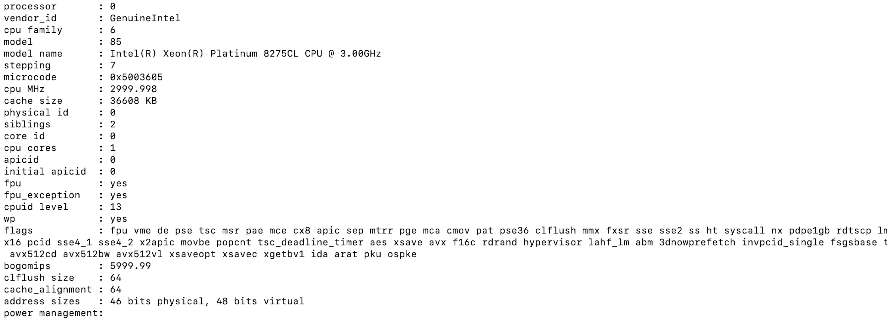
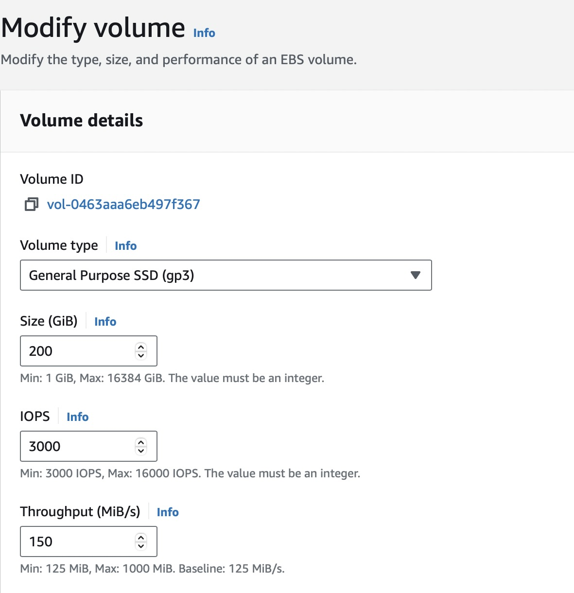
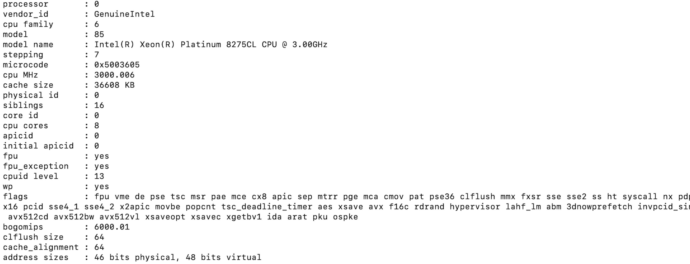

# Sizing guidance for rendering in a large-sized Kubernetes configuration

This topic provides the details of the environments used for rendering in a large-sized Kubernetes configuration. You can also find the test results and recommendations for large configurations on this page.

## Methodology

This sizing activity rendered scenarios for the Web Content Manager (WCM), Digital Asset Management (DAM), and HCL Digital Experience (DX) pages and portlets. This activity used a rendering setup enabled in AWS/Native-Kubernetes, where Kubernetes is installed directly in Amazon Elastic Cloud Compute (EC2) instances. A combination run was performed that rendered WCM content, DAM assets, and DX pages and portlets. The load distribution was WCM content (40%), DAM assets (30%), and DX pages and portlets (30%). All systems were pre-populated before performing the rendering tests.

To achieve the 30,000 concurrent users mark, an initial set of runs was done with a lower number of users on a multiple node setup with varying numbers of worker nodes. The tests started with 14 worker nodes. The number of worker nodes and pods were increased as needed to achieve the desired load with an acceptable error rate (< 0.01%). After establishing the number of nodes, further steps were taken to optimize the limits on the available resources for each pod, as well as the ratios of key pods to each other.

The following table contains the rendering scenario details for a large configuration. 

| Concurrent users     |  WCM pages         |  DAM content         |  Pages and portlets content   |
| -------------------- | ------------------ | -------------------- | ----------------------------- |
| 30,000 users         | 2000               | 250,000              |    600                        |

For more information about the setup of test data, refer to the following sections:

- [WCM default test data](./index.md#wcm-default-test-data)
- [DAM default test data](./index.md#dam-default-test-data)
- [Pages and portlets default test data](./index.md#pages-and-portlets-default-test-data)

## Environment

This section provides details for the Kubernetes cluster, Load Balancer, JMeter agents, LDAP, and tuning setups used for this activity.

### AWS/Native Kubernetes

The Kubernetes platform ran on an Amazon EC2 instance with the DX images installed and configured. In AWS/Native Kubernetes, the tests were executed in EC2 instances with 1 c5.2xlarge master node and 14 c5.4xlarge worker nodes. Refer to the following node setup details:

#### c2.4xlarge instance details

| Attribute          | Details                          |
|--------------------|----------------------------------|
| vCPUs              | 8                                |
| Memory             | 16 GiB                           |
| EBS-Optimized      | Yes (7500 Mbps bandwidth)        |
| Network Bandwidth  | Up to 10 Gbps                    |
| EBS Volume Type    | General Purpose (gp3/gp2), io1/io2 |
| Processor          | Intel(R) Xeon(R) Platinum 8275CL CPU @ 3.00GHz |
| Architecture       | x86_64                           |
| ENA Support        | Yes                              |
| NVMe Support       | Yes (EBS via NVMe)               |

#### c5.4xlarge instance details

| Attribute          | Details                          |
|--------------------|----------------------------------|
| vCPUs              | 16                               |
| Memory             | 32 GiB                           |
| EBS-Optimized      | Yes (8500 Mbps bandwidth)        |
| Network Bandwidth  | Up to 10 Gbps                    |
| EBS Volume Type    | General Purpose (gp3/gp2), io1/io2 |
| Processor          | Intel(R) Xeon(R) Platinum 8275CL CPU @ 3.00GHz |
| Architecture       | x86_64                           |
| ENA Support        | Yes                              |
| NVMe Support       | Yes (EBS via NVMe)               |

- **c5.2xlarge master node**

      - Node details

      { width="1000" }

      { width="1000" }

      - Processor details

      { width="1000" }

      - Volume details

      { width="600" }

- **c5.4xlarge worker nodes**

      - Node details
      
      { width="1000" }
      
      { width="1000" }

      - Processor details

      { width="1000" }

      - Volume details

      { width="600" }

- **c5.2xlarge NFS**
    
     { width="1000" }

### DB2 instance

The tests used a c5.4xlarge remote DB2 instance for the webEngine database. Refer to the following DB2 setup details:

**c5.4xlarge remote DB2 instance**

- DB2 details

      { width="1000" }

      { width="1000" }

- Processor details

      { width="600" }

- Volume details

      { width="600" }

### NFS  tuning details

We initially conducted tests with a 12 worker node setup and observed that, during a 20,000 Vuser load test, most worker nodes exhibited high CPU usage exceeding 80%. To achieve our target of supporting 30,000 Vusers,IOPS and throught put of nfs instance volume is doubled now.

Effect: Increasing the IOPS provided the necessary "horsepower" for our NFS storage to keep up with the intense I/O demands of your PostgreSQL database, thus stabilizing the entire persistence layer.

### Load Balancer setup

AWS Elastic Load Balancing (ELB) was used to distribute incoming application traffic across multiple targets automatically. The c5.4xlarge instances, which support network bandwidth of up to 10Gbps, were selected to handle more virtual users in a large configuration, making AWS ELB an optimal choice.

During the DX Kubernetes deployment, the HAProxy service type was updated from `LoadBalancer` to `NodePort` with a designated `serviceNodePort`. Then, the EC2 worker node instances hosting the HAProxy pods were added as a target group within the AWS ELB listeners.

### JMeter agents

To run the tests, a distributed AWS/JMeter agents setup consisting of 1 primary and 40 subordinate c5.2xlarge JMeter instances was used. Refer to the following JMeter setup details:

**c5.2xlarge JMeter instance**

- Instance details

      { width="1000" }

      { width="1000" }

- Processor details

      { width="600" }

- Volume details

      { width="600" }

!!!note
      Ramp-up time is five virtual users every two seconds. The test duration includes the ramp-up time plus one hour at the peak load of concurrent users.

### DX webEngine tuning

The following list contains details about the tuning and enhancements done to the DX webEngine during testing:

- Followed the same tunings used in the sizing activity for a [medium-sized configuration](./rendering_medium_config.md#dx-web engine-tuning).

- Increased the LTPA token timeout from 120 minutes to 600 minutes for the rendering tests.

!!!note
      For DAM, no tuning details are mentioned in this topic except for the pod resources like CPU and memory limits for all pods related to DAM, such as ring-api, persistence-node, persistence-connection-pool, and web engine. Since DAM uses `Node.js`, you can monitor CPU and memory usage using Prometheus and Grafana. Based on your observations, you can modify memory requests and limits in Kubernetes accordingly.

Modifications were also made to the initial Helm chart configuration during the tests. The following table outlines the pod count and limits for each pod. After applying these values, the setup showed significantly improved responsiveness. These changes allowed the system to handle 30,000 concurrent users with a substantial reduction in average response time and a minimal error rate.

|  |  | Request | Request | Limit | Limit |
|---|---|---:|---|---|---|
| **Component** | **No. of pods** | **cpu (m) ** | **memory (Mi) ** | **cpu (m) ** | **memory (Mi) ** |
| contentComposer | 1 | 100 | 128 | 100 | 128 |
| **webEngine** | **25** | **5600** | **8192** | **5600** | **8192** |
| **digitalAssetManagement** | **4** | **2000** | **4096** | **2000** | **4096** |
| imageProcessor | 1 | 200 | 2048 | 200 | 2048 |
| **openLdap** | **1** | **300** | **2048** | **300** | **2048** |
| **persistenceNode** | **3** | **3800** | **2048** | **3800** | **2048** |
| **persistenceConnectionPool** | **3** | **700** | **1024** | **700** | **1024** |
| **ringApi** | **2** | **500** | **2048** | **500** | **2048** |
| runtimeController | 1 | 100 | 256 | 100 | 256 |
| **haproxy** | **3** | **2500** | **2048** | **2500** | **2048** |
| licenseManager | 1 | 100 | 300 | 100 | 300 |
| **Total** | **45** | **222300** | **310000** | **222300** | **310000** |

!!!note
     Values in bold are tuned Helm values while the rest are default minimal values.

For convenience, these values were added to the `large-config-values.yaml` file in the `hcl-dx-deployment` Helm chart. To use these values, complete the following steps:

1. Download the `hcl-dx-deployment` Helm chart from FlexNet or Harbor.

2. Extract the `hcl-dx-deployment-XXX.tgz` file.

3. In the extracted folder, navigate to `hcl-dx-deployment/value-samples/large-config-values.yaml` and copy the `large-config-values.yaml` file.  

## Results

The initial test runs were conducted on an AWS-distributed Kubernetes setup with one master and eight worker nodes. The system successfully handled concurrent user loads of 10,000 and 15,000 with a low error rate (< 0.0001%). At 20,000 users, error rates increased dramatically and response times went up. For a response time to be considered optimal, it should be under one second.

Subsequent tests were conducted on a setup with 14 worker nodes which evaluated various user loads up to 30,000 concurrent users. The error rates remained low (<0.0001%) and response times were satisfactory. Adjustments were made to the number of pods, CPU, and memory for the following containers: HAProxy, web engine, RingAPI, digitalAssetManagement, persistenceNode, and persistenceConnectionPool. These changes aimed to identify the most beneficial factors for the sizing activity And Increasing the IOPS provided the necessary "horsepower" for our NFS storage to handle the high I/O demands of the PostgreSQL database. This improvement has significantly stabilized the persistence layer.

For the webEngine pod, increasing the CPU limit gave a boost to performance, but this effect eventually saturated at 5600 millicore. This result indicated that increasing the number of webEngine pods at this point provided additional benefits.

## Conclusion

There are several factors that can affect the performance of DX in Kubernetes. Changes in the number of running nodes, number of pods, and the capacity of individual pods can improve HCL DX performance. Any changes should be closely monitored to ensure precise tracking of resource utilization.

!!!note
     For more information on OS tuning, Web Server tuning, JSF best practices, and other performance tuning guidelines and recommendations for traditional deployments, refer to the [Performance Tuning Guide for Traditional Deployments](../traditional_deployments.md).

### Recommendations

- For a large-sized workload in AWS, start the Kubernetes cluster with 1 master and 14 worker nodes.

- To increase the throughput for the HAProxy and RingAPI containers, increase their CPU allocations. Note that increasing the number of pods does not increase throughput.

- To boost performance for the DAM and persistence-node pods, increase the CPU limits first, then increase the number of pod replicas. Increasing the number of pods also increases throughput for DAM.

- We have 25 pods for webengine,4 pods of DAM, 3 node pods,3 pool pods,3 pods of Haproxy and 2 Ring.We have 1 Master ,14 worker and 1 dedicated NFS node as the set up And Increasing the IOPS provided the necessary "horsepower" for our NFS storage to handle the high I/O demands of the PostgreSQL database. This improvement has significantly stabilized the persistence layer

- To hold more authenticated users for testing purposes, increase the OpenLDAP pod values. Note that the deployment of the OpenLDAP container in a production environment is not supported. For more information, refer to [Configure Applications - OpenLDAP configuration](../../../../deployment/install/container/helm_deployment/preparation/optional_tasks/optional_configure_apps.md#openldap-configuration).

- To optimize the webEngine container, increase the CPU allocation until the container saturates. After the optimal CPU level is determined, increase the number of pods to boost performance.

- To improve response times, increase the number of webEngine pods proportionally to the user load. For example, 8 webEngine pods were used for a load of 10,000 concurrent users, and 25 webEngine pods for a load of 30,000 concurrent users.

- To prevent Out of Memory (OOM) issues, increase the memory allocation for the DAM and HAProxy pods by approximately 1024Mi for every 10,000 concurrent users.

- To ensure optimal CPU allocation for the HAProxy pod, allocate 1 additional CPU for every 10,000 concurrent users.

### Recommended heap size configuration

To ensure optimal performance and stability of HCL DX on Kubernetes, it is essential for you to configure JVM heap memory and pod resource limits correctly. Refer to the following best practices when tuning memory allocation.

!!!note
     Do not set your JVM heap size larger than the allotted memory for the pod.

- Ensure your minimum heap size (`-Xms`) is equal to your maximum heap size (`-Xmx`). 
      - Setting the minimum and maximum heap sizes to the same value prevents the JVM from dynamically requesting additional memory (`malloc()`). 
      - This eliminates the overhead of heap expansion and improves performance consistency.

- Ensure the Kubernetes pod resource limits match the JVM heap settings
      - The requested memory (`requests.memory`) should match the limit (`limits.memory`) in the pod specification.
      - This ensures that the container is allocated a fixed memory block and prevents unexpected memory reallocation, which could lead to performance degradation or out-of-memory (OOM) errors.

- Determine the final memory requirements based on load testing
      - To determine the optimal memory configuration, you should conduct local testing with your specific portlets, pages, and customizations. You should also perform synthetic load testing using tools like JMeter to simulate realistic usage scenarios.
      - The required memory is highly dependent on Service Level Agreements (SLAs) and transaction rates.
      - A minimum of 3.5GB is recommended, but higher memory allocations may be necessary depending on actual usage patterns.

???+ info "Related information"
    - [Performance Tuning Guide for Traditional Deployments](../traditional_deployments.md)
