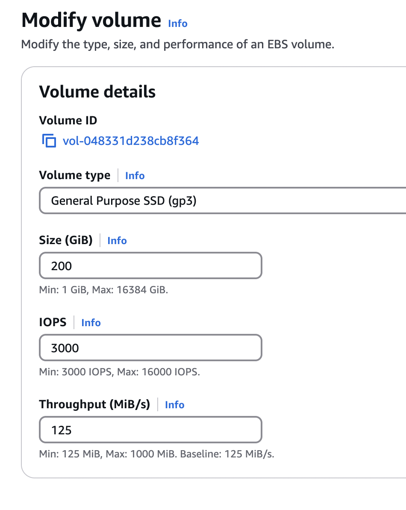

# Sizing guidance for rendering in a small-sized Kubernetes configuration

This topic provides the details of the environments used for rendering in a small-sized Kubernetes configuration. You can also find the test results and recommendations for small configurations on this page.

## Methodology

This sizing activity rendered scenarios for the Web Content Manager (WCM), Digital Asset Management (DAM), and HCL Digital Experience (DX) Compose pages and portlets. This activity used a rendering setup enabled in AWS/Native-Kubernetes, where Kubernetes is installed directly in Amazon Elastic Cloud Compute (EC2) instances. A combination run was performed that rendered WCM content, DAM assets, and DX Compose pages and portlets. The load distribution was WCM content (40%), DAM assets (30%), and DX Compose pages and portlets (30%). All systems were pre-populated before performing the rendering tests.

To achieve the 1,000 concurrent users mark, an initial set of runs was done with a lower number of users on a single node setup. The tests started with the desired load of 1,000 users and an acceptable error rate (< 0.01%). Further steps were taken to optimize the limits on the available resources for each pod.

The following table contains the rendering scenario details for a small configuration. 

| Concurrent users     |  WCM pages         |  DAM content         |  Pages and portlets content   |
| -------------------- | ------------------ | -------------------- | ----------------------------- |
| 1,000 users          | 20                 | 2,500                |    6                          |

For more information about the setup of test data, refer to the following sections:

- [WCM default test data](./index.md#wcm-default-test-data)
- [DAM default test data](./index.md#dam-default-test-data)
- [Pages and portlets default test data](./index.md#pages-and-portlets-default-test-data)

## Environment

This section provides details for the Kubernetes cluster, JMeter agents, and database.

### AWS/Native Kubernetes

The Kubernetes platform was deployed on an Amazon EC2 instance with DX Compose images installed and configured. In the AWS/Native Kubernetes setup, the tests were conducted on three EC2 instances using a c5.2xlarge node. This instance type was used for the remote DB2 instance (core database) and the JMeter instance.

Refer to the following setup details:

**c5.2xlarge**

- Node details

      { width="1000" }
      
      { width="1000" }

- Processor details

      { width="600" }

- Volume details

      { width="400" }

!!!note
      Ramp-up time is 0.4 seconds per user. The test duration includes the ramp-up time plus one hour at the peak load of concurrent users.

## Results

The test results revealed no errors or pod restarts during execution. Following the implementation of the [tuning changes](./rendering_small_config.md#dx-compose-tuning), there was a significant improvement in both the total average response time and overall throughput. Furthermore, the average response time for the top five requests demonstrated a marked enhancement, confirming the effectiveness of the optimizations.

The test results were analyzed using Prometheus and Grafana dashboards. Resource limits were adjusted based on CPU and memory usage observations from Grafana during the load tests. For HAProxy and webEngine pods, the CPU and memory limits were fully utilized and were subsequently increased.

Additionally, after reviewing and updating the cache statistics tool, optimal performance was achieved, with improvements in both average and 95th percentile response times. Increasing webEngine CPU cores by 1.3, adjusting HAProxy from 200m to 500m, and modifying ringApi from 100m to 200m led to a significant improvement in the total average response time, resulting in a tenfold increase in performance. To support these adjustments, CPU limits for persistenceNode, persistenceConnectionPool, and imageProcessor were reduced, prioritizing the optimization of rendering scenarios.

The next section provides detailed guidance on using the cache statistics tool and the tuning steps.

## WebEngine Cache Statistics tool

The WebEngine Cache Statistics tool allows you to monitor the OpenLiberty Dynacache statistics for the DX Compose webEngine pod.

To use the Dynacache Statistics tool, copy the [LibertyCacheStatistics](./LibertyCacheStatistics.war) WAR file into the `defaultServer/dropins` folder of the `webEngine` pod.  Then, run the following `kubectl` command:

```
kubectl cp LibertyCacheStatistics.war dx-deployment-web-engine-0:/opt/openliberty/wlp/usr/servers/defaultServer/dropins -n <namespace>
```
To access the cache statistics, open the following URL in your browser: `https://<hostName>/LibertyCacheStatistics/`. This page displays detailed cache information, including sizes, explicit removals, and Least Recently Used (LRU) removals.

### DX Compose tuning

Modifications to the initial Helm chart configuration were applied during testing. The following table specifies the pod count and resource limits for each pod. Additionally, certain WCM Dynacache sizes, lifetimes, and JVM heap sizes were adjusted based on cache statistics. For further details, see the [Recommendations](./rendering_small_config.md#recommendations) section on performing a Helm upgrade using `webengine-performance-rendering.yaml`

After applying the updated Helm values and cache adjustments, the system showed significantly improved responsiveness. These changes enabled the setup to handle 1,000 concurrent users with better error rates, reduced average response times, increased throughput, and improved 95th percentile response times.

|  |  | Request | Request | Limit | Limit |
|---|---|---:|---|---|---|
| **Component** | **No. of pods** | **cpu (m)<br>** | **memory (Mi)<br>** | **cpu (m)<br>** | **memory (Mi)<br>** |
| contentComposer | 1 | 100 | 128 | 100 | 128 |
| **webEngine** | 1 | **4300** | **5120** | **4300** | **5120** |
| digitalAssetManagement | 1 | 500 | 1536 | 500 | 1536 |
| **imageProcessor** | 1 | **100** | **768** | **100** | **768** |
| **openLdap** | 1 | **100** | **1024** | **100** | **1024** |
| **persistenceNode** | 1 | **200** | 1024 | **200** | 1024 |
| **persistenceConnectionPool** | 1 | **300** | 512 | **300** | 512 |
| **ringApi** | 1 | **200** | 256 | **200** | 256 |
| runtimeController | 1 | 100 | 256 | 100 | 256 |
| **haproxy** | 1 | **500** | **512** | **500** | **512** |
| licenseManager | 1 | 100 | 300 | 100 | 300 |
| **Total** | | **6500** | **11436** | **6500** | **11436** |


!!!note
     - Values in bold are tuned Helm values while the rest are default minimal values.
     - Cache value changes depending on the test data. It is recommended to monitor cache statistics regularly and update them as necessary. To learn how to monitor cache statistics, refer to the [WebEngine Cache Statistics Tool](./rendering_small_config.md#webengine-cache-statistics-tool).

For convenience, these values were added to the `small-config-values.yaml` file in the hcl-dx-deployment Helm chart. To use these values, refer to the following steps:

1. Download the `hcl-dx-deployment` Helm chart from FlexNet or Harbor.

2. Extract the `hcl-dx-deployment-XXX.tgz` file.

3. In the extracted folder, navigate to `hcl-dx-deployment/value-samples/webEngine/small-config-values.yaml` and copy the `small-config-values.yaml` file.

## Conclusion

This guidance outlines the maximum capacity for a single-node Kubernetes cluster deployed on an AWS c5.2xlarge instance. For rendering scenarios involving DAM, WCM, and DX Compose pages with portlets on a c5.2xlarge single-node setup, the recommended load is up to 1,000 concurrent users.

## Recommendations

- For a small-sized workload in AWS, start the Kubernetes cluster with a single node using at least a c5.2xlarge instance to support a load of 1,000 users.

- To hold more authenticated users for testing purposes, increase the OpenLDAP pod CPU and memory values. Note that the OpenLDAP pod is not for production use.

- To improve response times, perform the Helm upgrade using the `webengine-performance-rendering.yaml` file. This file is available in the HCL DX Compose Deployment Helm chart. To use this file, complete the following steps:
       1. Download the hcl-dx-deployment Helm chart from FlexNet or Harbor.
       2. Extract the hcl-dx-deployment-XXX.tgz file.
       3. In the extracted folder, navigate to `hcl-dx-deployment/performance/webengine-performance-rendering.yaml` and copy the `webengine-performance-rendering.yaml`.

       After performing a Helm upgrade using the `webengine-performance-rendering.yaml` file, the tuned cache values for rendering will be updated.

### Recommended heap size configuration

To ensure optimal performance and stability of HCL DX Compose on Kubernetes, it is essential for you to configure JVM heap memory and pod resource limits correctly. Refer to the following best practices when tuning memory allocation.

!!!note
     Do not set your JVM heap size larger than the allotted memory for the pod.

- Ensure your minimum heap size (`-Xms`) is equal to your maximum heap size (`-Xmx`).
      - Setting the minimum and maximum heap sizes to the same value prevents the JVM from dynamically requesting additional memory (`malloc()`). 
      - This eliminates the overhead of heap expansion and improves performance consistency.
- Ensure the Kubernetes pod resource limits match the JVM heap settings
      - The requested memory (`requests.memory`) should match the limit (`limits.memory`) in the pod specification.
      - This ensures that the container is allocated a fixed memory block and prevents unexpected memory reallocation, which could lead to performance degradation or out-of-memory (OOM) errors.
- Determine the final memory requirements based on load testing
      - To determine the optimal memory configuration, you should conduct local testing with your specific portlets, pages, and customizations. You should also perform synthetic load testing using tools like JMeter to simulate realistic usage scenarios.
      - The required memory is highly dependent on Service Level Agreements (SLAs) and transaction rates.
      - A minimum of 3.5GB is recommended, but higher memory allocations may be necessary depending on actual usage patterns.