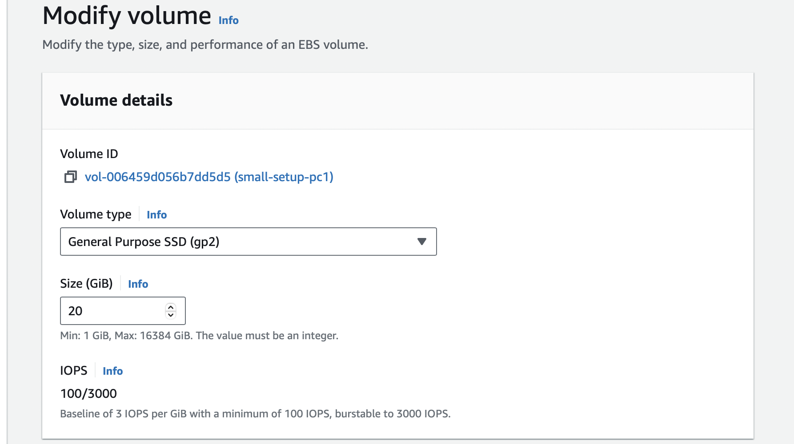
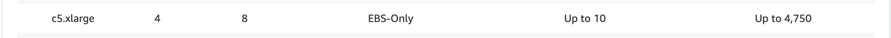
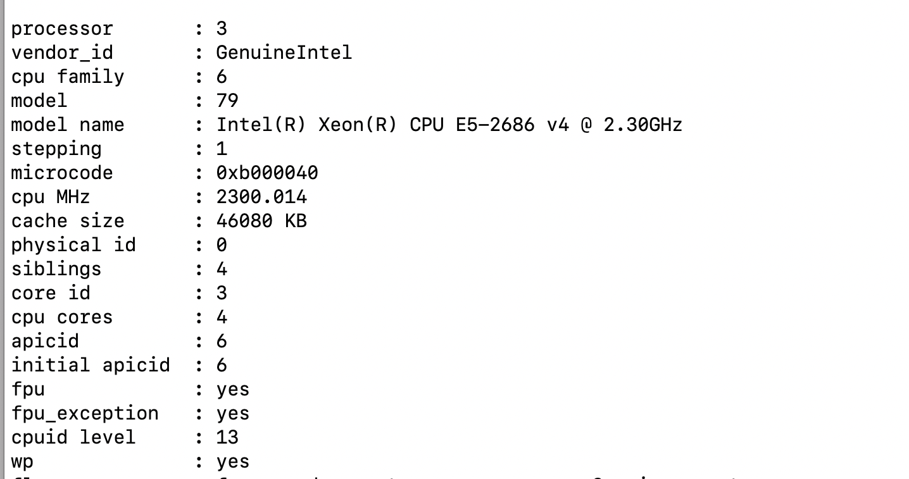
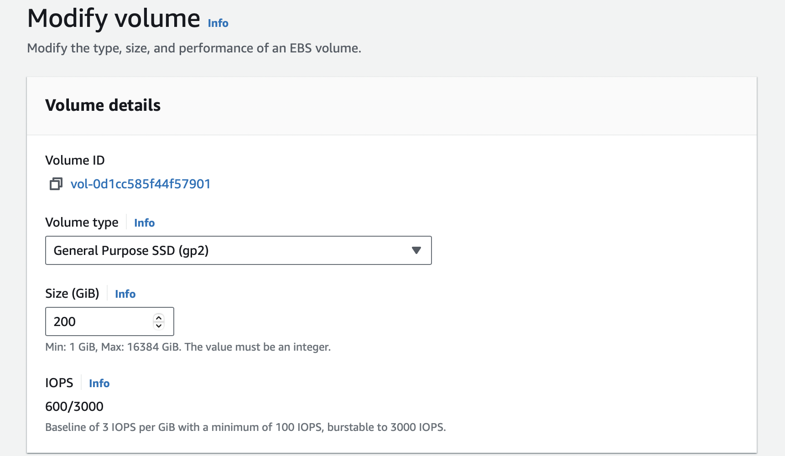
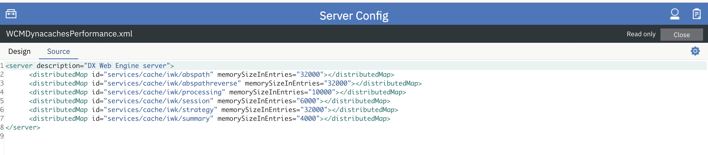

# Sizing guidance for rendering in a small-sized Kubernetes configuration

This topic provides the details of the environments used for rendering in a small-sized Kubernetes configuration. You can also find the test results and recommendations for small configurations on this page.

## Methodology

This sizing activity rendered scenarios for the Web Content Manager (WCM), Digital Asset Management (DAM), and HCL Digital Experience (DX) pages and portlets. This activity used a rendering setup enabled in AWS/Native-Kubernetes, where Kubernetes is installed directly in Amazon Elastic Cloud Compute (EC2) instances. A combination run was performed that rendered WCM content, DAM assets, and DX pages and portlets. The load distribution was WCM content (40%), DAM assets (30%), and DX pages and portlets (30%). All systems were pre-populated before performing the rendering tests.

To achieve the 1,000 concurrent users mark, an initial set of runs was done with a lower number of users on a single node setup. The tests started with the desired load of 1,000 users and an acceptable error rate (< 0.01%). Further steps were taken to optimize the limits on the available resources for each pod.

The following table contains the rendering scenario details for a small configuration. 

| Concurrent users     |  WCM pages         |  DAM content         |  Pages and portlets content   |
| -------------------- | ------------------ | -------------------- | ----------------------------- |
| 1,000 users          | 20                 | 2,500                |    8                          |

For more information about the setup of test data, refer to the following sections:

- [WCM default test data](./index.md#wcm-default-test-data)
- [DAM default test data](./index.md#dam-default-test-data)
- [Pages and portlets default test data](./index.md#pages-and-portlets-default-test-data)

## Environment

This section provides details for the Kubernetes cluster, JMeter agents, and database.

### AWS/Native Kubernetes

The Kubernetes platform ran on an Amazon EC2 instance with the DX images installed and configured. In AWS/Native Kubernetes, the tests were executed in EC2 instances with one c5.2xlarge node. Refer to the following node setup details:

**c5.2xlarge node**

- Node details

      { width="1000" }
      
      { width="1000" }

- Processor details

      { width="600" }

- Volume details

      { width="600" }

### DB2 instance

The tests used a c5.2xlarge remote DB2 instance for the core database. Refer to the following DB2 setup details:

**c5.2xlarge remote DB2 instance**

- DB2 details

       { width="1000" }

       { width="1000" }

- Processor details

       { width="600" }

- Volume details

       { width="600" }

### JMeter agents

To run the tests, a distributed AWS/JMeter agents setup consisting of one primary and two subordinate C5.xlarge instances was used. Refer to the following JMeter setup details:

**C5.xlarge JMeter instance**

- Instance details

       { width="1000" }

       { width="1000" }

- Processor details

       { width="600" }

- Volume details

       { width="600" }

!!!note
      Ramp-up time is 0.5 seconds per user. The test duration includes the ramp-up time plus one hour at the peak load of concurrent users.

### DX Compose tuning

Modifications were made to the initial Helm chart configuration during the tests. The following table outlines the pod count and limits for each pod. After applying these values, the setup showed significantly improved responsiveness. These changes allowed the system to handle 1,000 concurrent users with an improved error rate, average response time, throughput, and an event loop lag of Ring API containers.

|                               |                 | Request         | Request             | Limit           | Limit                |
|-------------------------------|-----------------|-----------------|---------------------|-----------------|----------------------|
| **Component**                 | **No. of pods** | **CPU (m) ** | **Memory (Mi) ** | **CPU (m) ** | **Memory (Mi) **  |
| **Webengine**                 | **1**           | **4300**        | **6144**            | **4300**        | **6144**             |
| digitalAssetManagement        | 1               | 500             | 1536                | 500             | 1536                 |
| **imageProcessor**            | 1               | 200             | **768**             | 200             | **768**              |
| **openLdap**                  | 1               | 200             | **1024**            | 200             | **1024**             |
| **persistenceNode**           | 1               | **200**         | **500**             | **100**         | **500**              |
| **persistenceConnectionPool** | 1               | **300**         | **512**             | **300**         | **512**              |
| **ringApi**                   | 1               | **200**         | **256**             | **200**         | **256**              |
| **haproxy**                   | 1               | **500**         | **500**             | **500**         | **500**              |
| **Total**                     |                 | **6400**        | **11240**           | **6300**        | **11240**            |

!!!note
     Values in bold are tuned Helm values while the rest are default minimal values.

## Results

 The test results showed no errors or pod restarts throughout the execution. After implementing the tuning changes, both the total average response time and overall throughput improved significantly. Additionally, the average response time for the top five requests showed a noticeable improvement, further validating the effectiveness of the optimizations.

## Conclusion

This guidance shows the upper limit on a single-node K8s cluster AWS c5.2xlarge instance. For c5.2xlarge single-node rendering scenarios for DAM, WCM, and DX pages with portlets, the recommended load is 1,000 concurrent users.

## Recommendations

- For a small-sized workload in AWS, start the Kubernetes cluster with a single node using at least a c5.2xlarge instance to support a load of 1,000 users.

- To hold more authenticated users for testing purposes, increase the OpenLDAP pod CPU and memory values. Note that the OpenLDAP pod is not for production use.

- To improve response times, perform the Helm upgrade using the `webengine-performance-rendering.yaml` file. This file is available in the HCL DX Deployment Helm chart. To use this file, complete the following steps:

       1. Download the hcl-dx-deployment Helm chart from FlexNet or Harbor.
       2. Extract the hcl-dx-deployment-XXX.tgz file.
       3. In the extracted folder, navigate to hcl-dx-deployment/performance/webengine-performance-rendering.yaml and copy the `webengine-performance-rendering.yaml`.

       After performing the Helm upgrade using the `webengine-performance-rendering.yaml` file, the following cache values will be updated.

       { width="1000" }

???+ info "Related information"
    - [Performance Tuning Guide for Traditional Deployments](../traditional_deployments.md)
