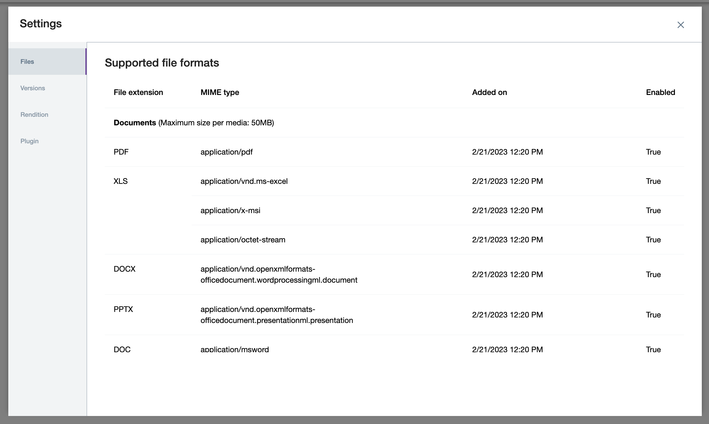
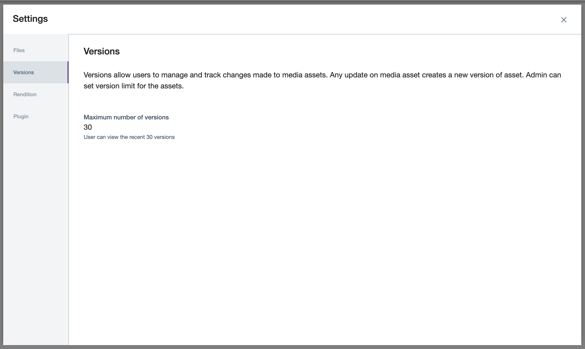
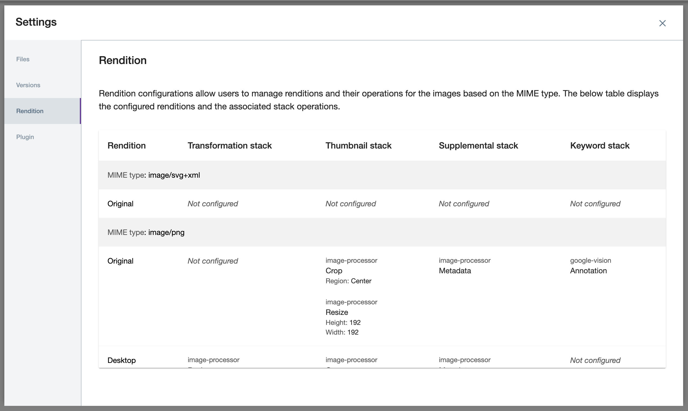
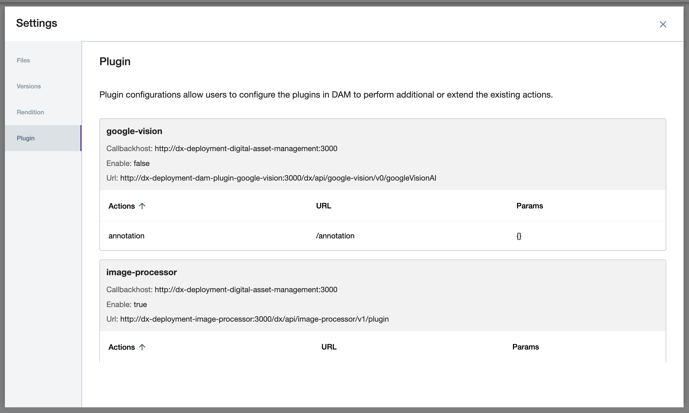

# Extensibility Configurations

This topic describes how to configure DAM extensibility in the configuration folder for Helm packages.

## Configure DAM extensibility

Rendition, plug-in, Kaltura configurations are expected to be config maps in DAM. And these are maintained in the values.yaml and can be deployed through a Helm upgrade.

Refer to the section [Planning your container deployment using Helm](../../../../deploy_dx/install/container/helm_deployment/preparation/index.md) for more information on Helm support.

Once configured, DAM gets the latest config maps to handle assets and their transformations.

You must copy the configuration to a custom values.yaml file and updated the required configuration.

Below is the sample configuration for renditions

```
configuration:
    # Digital asset management configurations
    digitalAssetManagement:
      # Configuration for extensibility
      extensibility:
        renditionsConfiguration:
            image/svg+xml:
                rendition:
                - name: Original
                transformationStack: []
                thumbnailStack: []
                supplementalStack: []
            image/png:
                rendition:
                - name: Original
                transformationStack: []
                thumbnailStack:
                - plugin: image-processor
                    operation:
                    crop:
                        region: CENTER
                - plugin: image-processor
                    operation:
                    resize:
                        height: 192
                        width: 192
                supplementalStack:
                - plugin: image-processor
                    operation:
                    metadata: {}
                - plugin: google-vision
                    operation:
                    annotation: {}
                - name: Desktop
                transformationStack:
                - plugin: image-processor
                    operation:
                    resize:
                        height: 1080
                        width: 1920
                thumbnailStack:
                - plugin: image-processor
                    operation:
                    crop:
                        region: CENTER
                - plugin: image-processor
                    operation:
                    resize:
                        height: 192
                        width: 192
                supplementalStack:
                - plugin: image-processor
                    operation:
                    metadata: {}
                - name: Tablet
                transformationStack:
                - plugin: image-processor
                    operation:
                    resize:
                        height: 768
                        width: 1024
                thumbnailStack:
                - plugin: image-processor
                    operation:
                    crop:
                        region: CENTER
                - plugin: image-processor
                    operation:
                    resize:
                        height: 192
                        width: 192
                supplementalStack:
                - plugin: image-processor
                    operation:
                    metadata: {}
                - name: Smartphone
                transformationStack:
                - plugin: image-processor
                    operation:
                    resize:
                        height: 760
                        width: 360
                thumbnailStack:
                - plugin: image-processor
                    operation:
                    crop:
                        region: CENTER
                - plugin: image-processor
                    operation:
                    resize:
                        height: 192
                        width: 192
                supplementalStack:
                - plugin: image-processor
                    operation:
                    metadata: {}
```

!!! note 
    The default renditions and stacks under those default renditions cannot be removed. For eg., cannot remove the stack configurations under the renditions but can be modified. Even if they are removed, those default configurations will still be available.
    In the original rendition, the transformations stack should be always empty. Even if anything is configured, it will not be considered during the uploads.

Below is the sample configuration for Plugins

```
configuration:
    # Digital asset management configurations
    digitalAssetManagement:
      # Configuration for extensibility
      extensibility:
            pluginsConfiguration:
                image-processor:
                    url: http://RELEASE_NAME-image-processor:DAM_HTTP_PORT/dx/api/image-processor/v1/plugin
                    callBackHost: http://RELEASE_NAME-digital-asset-management:DAM_HTTP_PORT
                    authKey: key
                    enable: true
                    actions:
                    crop:
                        params: {}
                        url: "/crop"
                    resize:
                        params: {}
                        url: "/resize"
                    rotate:
                        params: {}
                        url: "/rotate"
                    metadata:
                        params: {}
                        url: "/metadata"
```
## Configure plug-in security

When using DAM extensibility, plug-ins come with security enabled by default. API requests are authenticated with the security key, which is sent and validated in both `Plugin-API` and `Callback-API` requests. You can configure these under the same config file \(under security configuration\) with the value authenticationKey. This value is sent for the plug-in configuration key attribute, and is sent by DAM with each request to authenticate.

```
# Security related configuration, e.g. default credentials
  security:
    # Security configuration for Image processor
    imageProcessor:
      # Authentication key for Plugin API
      authenticationKey: "hKey"
```

## Configure custom renditions

Similar to default renditions, DAM also supports custom renditions and this can be configured in values.yaml under DAM configurations. for example, below steps for adding custom rendition for jpeg image mime-type

1. Copy renditions configurations for jpeg image mime type from values.yaml and add it in the same configuration path in custom values file. and add custom rendition along with default renditions

```
# Application configuration
configuration:
  renditionsConfiguration:
    image/jpeg:
      rendition:
      - name: Original
        transformationStack: []
        thumbnailStack:
        - plugin: image-processor
        operation:
            crop:
            region: CENTER
        - plugin: image-processor
        operation:
            resize:
            height: 192
            width: 192
        supplementalStack:
        - plugin: image-processor
        operation:
            metadata: {}
        - plugin: google-vision
        operation:
            annotation: {}
      - name: Desktop
        transformationStack:
        - plugin: image-processor
        operation:
            resize:
            height: 1080
            width: 1920
        thumbnailStack:
        - plugin: image-processor
        operation:
            crop:
            region: CENTER
        - plugin: image-processor
        operation:
            resize:
            height: 192
            width: 192
        supplementalStack:
        - plugin: image-processor
        operation:
            metadata: {}
      - name: Tablet
        transformationStack:
        - plugin: image-processor
        operation:
            resize:
            height: 768
            width: 1024
        thumbnailStack:
        - plugin: image-processor
        operation:
            crop:
            region: CENTER
        - plugin: image-processor
        operation:
            resize:
            height: 192
            width: 192
        supplementalStack:
        - plugin: image-processor
        operation:
            metadata: {}
      - name: Smartphone
        transformationStack:
        - plugin: image-processor
        operation:
            resize:
            height: 760
            width: 360
        thumbnailStack:
        - plugin: image-processor
        operation:
            crop:
            region: CENTER
        - plugin: image-processor
        operation:
            resize:
            height: 192
            width: 192
        supplementalStack:
        - plugin: image-processor
        operation:
            metadata: {}
      - name: Custom
        transformationStack:
        - plugin: image-processor
          operation:
            resize:
            height: 760
            width: 360
        thumbnailStack:
        - plugin: image-processor
          operation:
            crop:
            region: CENTER
        - plugin: image-processor
          operation:
            resize:
            height: 192
            width: 192
        supplementalStack:
        - plugin: image-processor
          operation:
            metadata: {}
```

## Configure metadata

Similar to rendition and thumbnail actions such as crop and resize, the Image processor plugin also supports metadata extraction so that DAM invokes the Image processor plugin by default. In the case of a custom plugin, the corresponding API can be configured in the Plugins configuration as follows.

Add metadata to the new stack configuration `SupplementalStack` in rendition configuration.

!!! note 
    The operation name needs to be `metadata` and cannot contain any custom names. The plugin that is used should also contain the metadata as one of the actions (In this case the plugin is the image processor. Refer the plugin configuration above).


    !!! example

        ```
        
        image/jpeg:
        rendition:
        - name: Original
          transformationStack: []
          thumbnailStack:[]
          supplementalStack:
          - plugin: image-processor
            operation:
              metadata: {}
        ```
## Viewing DAM extensibility configurations

DAM extensibility configurations can be seen on the settings page.

1.  Click the **Settings Icon** to open the settings page.


2.  Click on menu options to view their settings:
    -   **Files** – Displays supported file types and maximum supported file size. 
    
    -   **Versions** - Displays the maximum number of supported versions.
    
    -   **Renditions** - Displays rendition configurations to manage renditions and their operations for the images based on the MIME type.
    
    -   **Plugin** - Displays plugin configurations in DAM to perform additional or extend the existing actions.
    

!!! note 
    Clear the browser cache in order to see the updated plugin configurations and rendition configurations after the helm upgrade.

<!--

## HCL Digital Experience Solution Feedback

HCL Digital Experience is interested in your experience and feedback working with HCL Digital Experience 9.5 release software. To offer comments or issues on your findings, please access the [HCL Digital Experience 9.5 Feedback Reporting application](https://www.hclleap.com/apps/secure/org/app/158bbc7c-f357-4ef0-8023-654dd90780d4/launch/index.html?form=F_Form1). -->

